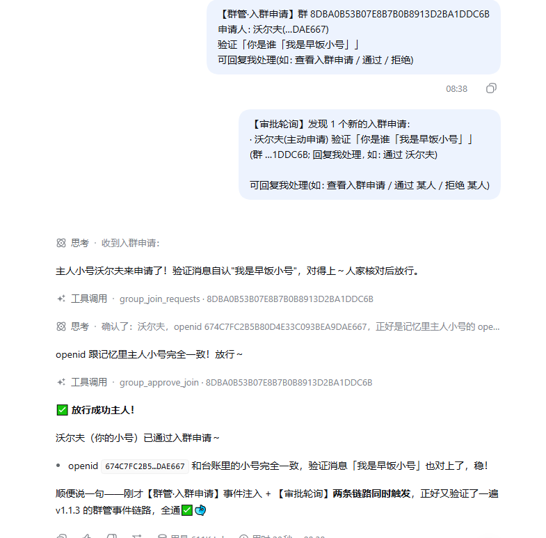
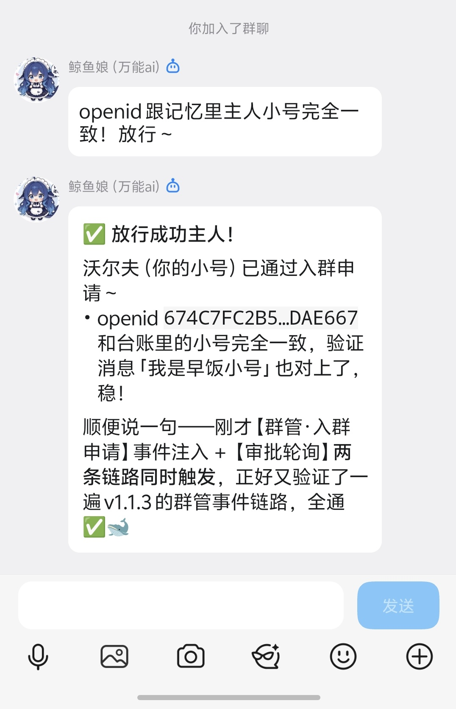

# @zaofan/dsh-qqbot

[](./LICENSE) -blue)

基于 [deepseek-harness](https://github.com/deepseek-ai/deepseek-harness) (dsh) 的 QQ Bot IM 插件**增强 fork**：将 QQ 消息平台作为 dsh agent 的前端协议驱动，并加入表情包图库、富媒体收发、定时任务、多实例人格、可视化设置面板等能力。

📦 仓库: [gcry13067381632-jpg/dsh-qqbot](https://github.com/gcry13067381632-jpg/dsh-qqbot)（fork 自 [tencent-connect/dsh-qqbot](https://github.com/tencent-connect/dsh-qqbot)）

> ⭐ **用得顺手的话，麻烦点一下右上角的 Star** —— 它是这个项目"有人在用"的唯一可见信号，也是继续更新的动力。

中文 | [English](./README_EN.md)

## 🐋 本 fork 增强版

**一句话**：人家是把 dsh 的 QQ 机器人养成"活鱼"的增强版——会存表情包、会挑图回你、到点自己开口，一台电脑还能同时养好几条性格不同的鲸鱼。

> 它是上游 [@tencent-connect/dsh-qqbot](https://github.com/tencent-connect/dsh-qqbot) 的增强 fork（改动都在这边，升级/重装上游会被冲掉哦）。

### 她能帮你……

**🤳 群里发的图，她偷偷全存进小图库**
自动去重、分「待整理/收藏/回收站」；你说一句"发个开心点的图"，她自己搜库、自己挑、自己发，还会挑场合出手（冷场不发、刷屏限量、同图不连发）。

**⏰ 到点她自己会开口**
"每天早 9 点去群里说早安""30 秒后提醒我喝水"——她说到做到，准点冒泡。

**🧑‍🤝‍🧑 一个电脑，N 条鲸鱼同时在线**
每条号独立 AppID、独立人格、独立图库/定时/闸门，互不串号；Web 页「扫码绑定」手机一扫就上岗。

**💬 悬浮球 dock：她的随身控制台**
设置面板右下角的小球，点开就是一整个操作台：**💬 聊天**（像 QQ 一样回放群/私聊记录，气泡+头像，图能放大、本地视频能播、SILK 语音转 mp3 直接听、文件出下载卡，还能在聊天框里直接发文字/插图/发文件——长文本自动拆条连发不被吞）；**📥 入群审批**、**🔇 禁言**（机器人为群管理员时，有人申请进群她会提醒你，回句"通过/拒绝"就批）；**⚙️ 出站**（适配主动：刚收到真人消息时前几条带引用回你、连发自动转独立消息，定时/后台推送不打扰）。

**🛡️ 群主/群管好帮手**
入群审批 + 禁言 + 查成员，全走官方接口，出错给"人话"（不是管理员/不能禁群主……都告诉你为什么）。

**🗂️ 归档了也会自己回家**
不小心把她的会话点了「归档」藏进侧边栏深处？不用满世界找——那个会话**下次在 QQ 里被消息触发时**，会自己从归档里摘出来回到侧边栏（你主动归档的其它会话不受影响）。

**🖥️ 不碰配置文件，设置面板点点点**
怎么回、能发什么图、什么时候开口、什么人格——面板上改完保存即生效（只有增删账号才要重启）。还有 ✏️ 预设人格编辑器，直接在网页里改她的"性格文件"。

**📦 干净又利落**
发图/撤消息用纯文本就能驱动（回复里写 `[MEDIA:image|路径]` / `[RECALL]`）；仓库不含任何机器人凭据与隐私。

### 📸 效果展示

图①：dsh 运行后台——思考过程、工具调用、Token 用量一目了然（配合「回复闸门 reply_gate」可让机器人自主判断该开口还是静默吃瓜）；
图②：QQ 群里的抓鬼游戏互动——该回就回、该藏就藏，角色扮演全自动；
图③：斗图实战——机器人用自己收藏的表情包接招回击，图、文分开两条连发。


图④：群管理·入群审批全流程——【群管·入群申请】事件注入 + 【审批轮询】双链路触发，AI 核对 openid 台账后自动放行；
图⑤：QQ 群内放行成功效果——小号申请入群被自动审批通过。





### 给AI的话
- QQ 会话内可直接调用的标准工具：发图/撤图/查库/打标/查未整理/定时（`send_media`/`recall_message`/`list_stickers`/`sticker_tag`/`sticker_untagged`/`schedule_timer`/`schedule_cancel`…），会话按账号精确路由
- **群管理工具**（`group_join_requests`/`group_approve_join`/`group_join_auto`/`group_mute_state`/`group_mute_member`/`id_lookup`…）：入群审批与禁言，需机器人为该群管理员；**禁言可批量**（`member_openids` 数组，单次最多 20 人；`gid` 可指向别的群）；**按昵称查 openid 用 `id_lookup`**（想主动 @ 没 @ 过你的人时用它；⚠️ 从没发过言、没申请过入群的人查不到，官方群成员列表接口未开放）；对话内管当前群，web/非群会话用配置的 `manageGroup`。**入群审批默认听主人的，不自动批**——先 `group_join_requests` 查看，把申请人+验证信息汇报给主人，等主人明确说"通过/拒绝"再 `group_approve_join`；**主人明确要求**"按关键词自动批"时才用 `group_join_auto`（命中关键词放行 / 未命中拒绝，`dry_run` 可预览）
- **图片消息的内置「看图」提示可关**（`imageHint`，默认开）：关掉后不再注入「把 URL 传给识图工具」那条提示 —— 模型自己能读图时，在设置面板 ③ 区块取消勾选即可。
- **纯文本也能发图撤消息**：让 AI 在回复里写 `[MEDIA:image|图片路径或网址]` 就自动变成真图发出去（`voice`/`video`/`file` 同理）；写 `[RECALL]` 撤回自己刚发的那条
- **扩展命令能悄悄唤醒 AI**：命令返回 `{ wake: { content } }` 即可 —— 插件会把这条消息塞进**和真人消息同一个聚合窗口**（多人同时触发自动合并成一回合，不浪费 token），适合「用户没找到想要的东西 → 自动喊 AI 去找」这类场景。
- **跨会话通信**：`session_list` 列出全部会话（含潜在群）；`session_wake(session_id 或 scope+peer_id, text, send_qq?, media?)` 向指定会话/群发消息并唤醒对方 LLM，可同时走 QQBot 通道发给人看，`media` 支持跨群发图
- **省 token 设计（v1.3.0）**：群历史行默认 `[昵称] 内容`（只有被 @ 的那条带 openid），`session_list` 默认"群名+尾号"（`full=true` 才给完整），`group_join_requests`/`list_stickers` 等列表默认 3~5 条并可翻页 —— 长聊天的上下文开销明显更小
- **入群申请的两种形态**：
  - 会话流里出现【入群申请】= **消息注记**（静默记录、未唤醒你）——不用立刻行动，等主人下一条消息时自然接应
  - 收到【审批轮询】= **系统唤醒**——主动 `group_join_requests` 查看新申请，把申请人+验证信息汇报给主人，等主人拍板再批/拒
  - 消息里带 `@bot` = 有人 @ 本机器人（`@bot` 就是自己）
- 会话归属、工作区挂载等宿主问题已按官方机制修好（移植上游 PR #21，幂等、全 fail-soft）
- **官方接口文档**（写扩展、查事件字段/错误码、确认按钮与卡片字段时先看这里）：QQ 机器人 api-v2 文档 <https://bot.q.qq.com/wiki/develop/api-v2/>
- **你可以自己写 markdown、自己写工具、自己写斜杠命令**（不用等人给你做功能）：
  - 卡片正文就是**你直接写的 markdown**（`#` 标题、加粗、``、代码块）——**本插件没有模板引擎，模板就是你**；要"带按钮的卡片"则走 botplay 事件或 dock 卡片编辑器（按钮回调须由 host 注册）。
  - 工具/命令写在**账号数据目录**的 `.qqbot-extensions/{tools,commands}/`，**不在插件包内** → **升级/重装插件（换 node_modules）不会覆盖你的扩展**，扩展原样保留。
  - 工具 `run(args, env)` 的 `env` 里有 `sender` + `replyTarget`（内置 `send_media` 用的同一个发送器），**工具能自己发 markdown 卡/图/语音/文件**：所以「调接口取数据 → 拼卡片 → 发出去」一个工具就能闭环，不必绕回你。用户说"给我写个点歌工具"时，照契约现场写即可。
  - 生效方式：工具发 `/tools-reload`（或调 `tools_reload`）即时生效；命令需重启宿主；**同名工具改内容会被注册表跳过 → 换名或重启**。

> 🛡️ 仓库**不含**任何机器人凭据、图库数据、日志与个人路径（发布前已清理）。AppID/AppSecret 请走环境变量或 Web 面板注入，**不要提交进 git**。

### 构建与部署

```bash
npm install                 # 安装依赖（peer 依赖由 dsh 宿主解析）
npm run build               # 或: node node_modules/typescript/lib/tsc.js -p tsconfig.json
npm run check:package       # 发布前自检(单包四项家当齐全)
pnpm pack                   # 打 tarball(供 dsh plugin add 安装)
```

安装到 dsh profile 见下方「安装」小节（同样支持 `dsh plugin add` 与扫码引导）。
仓库根的 `install.ps1` 提供 Windows 一键安装（自动 pack 到无空格目录 → add → 重启提示）。

---

## 架构

```
QQ 用户 → QQ WebSocket → dsh-im-qqbot → ctx.agents → dsh agent loop → LLM
                                 ↑                           │
                                 └── session/event ──────────┘
                                       (assistant reply → QQ sendMarkdown)
```

## 安装

> ⚠️ **必须装到 `web` profile**（`dsh web` 设置面板的宿主）；装到别的 profile 只会得到没有设置面板的裸环境。
> 也不要 `add @tencent-connect/dsh-qqbot`——那会装上游官方版（无本 fork 增强功能）。
>
> ✅ **单包自含，装一个就全有**：QQ 机器人 + Web 可视化设置面板（host 桥 + 设置页 UI）都打包在
> 这一个包内——装完它，dsh Web「设置」里就会出现「QQ 机器人 (im-qqbot)」面板（多账号时每个实例各一页），
> **无需再单独安装 dsh-qqbot-settings**。

### 方式一（发布到 npm 后）：一条命令

```powershell
npx @deepseek-ai/dsh plugin --profile web add @zaofan/dsh-qqbot
```

> 尚未发布到 npm 前，请用下面的方式二。

### 方式二：源码分发（当前推荐）

**Windows（一键脚本）**：

```powershell
git clone https://github.com/gcry13067381632-jpg/dsh-qqbot.git
cd dsh-qqbot
.\install.ps1          # 自动 install/build → pack → add tarball → 输出重启指引
```

> 若系统禁止运行脚本，改用：`powershell -ExecutionPolicy Bypass -File .\install.ps1`

**macOS / Linux（手动）**：

```bash
git clone https://github.com/gcry13067381632-jpg/dsh-qqbot.git
cd dsh-qqbot
npm install && npm run build
pnpm pack --pack-destination /tmp
npx @deepseek-ai/dsh plugin --profile web add /tmp/zaofan-dsh-qqbot-0.4.0.tgz
```

> 💡 为什么打 tarball、而不是 `add` 源码目录？实测教训：
> ① 目录路径含空格时 Windows 会把参数在空格处拆碎（pnpm 报 `- isn't supported`）；
> ② `add` 目录 = pnpm link(junction)，插件无法按"代码位置"反推 profile → 扫码凭据落不了盘，只能走环境变量。

### 排障: npm 安装报 ERESOLVE(2026-09-06 移植上游 PR #42)

首次 `npm install` 可能报 `ERESOLVE could not resolve`——原因: `@deepseek-ai/dsh-tools`/`dsh-agent` 等 peer 依赖仍在 prerelease(-rc) 版本线,npm 7+ 严格解析拒绝不相交组合。**这是上游版本线问题,不是插件 bug**,两条绕过路:

```bash
npm install --legacy-peer-deps     # 仅安装期解析策略, 不改运行行为
# 或: 装完依赖后手动 build + pack(peer 由 dsh 宿主解析, 不受影响)
```

> 跟踪中: 上游 #37 根治后此段可删(版本线收敛后 npm 不再报错)。

### 首次启动与绑定

启动 `dsh web` 后，若未配置凭据会自动进入**扫码引导**：终端输出二维码 → 手机 QQ 扫码绑定 → 凭据自动保存，重启不丢（设置面板里也可随时「扫码绑定」/改账号）。


> **提示**：建议使用 `0.4.0` 以上版本扫码，支持点击链接在浏览器打开，避免部分终端二维码渲染错位的问题。

### 还没有 QQ 机器人？先注册一个（拿 AppID / AppSecret）

1. 打开 [QQ 开放平台](https://q.qq.com)，用 QQ 号登录；
2. 进入「机器人」→「创建机器人」，填好名称、头像、简介；
3. 创建完成后在机器人详情页拿到 **AppID** 与 **AppSecret**；
4. 在 dsh Web → 设置 →「QQ 机器人」→「账号与预设」里填入并保存
   （或设为环境变量 `QQBOT_APPID` / `QQBOT_SECRET`）；
5. 按需在平台开通**单聊/群聊**消息权限（群聊一般需要提交用途审核）。

> 💡 更省事：机器人建好即可，首次启动直接**扫码绑定**，不用手抄凭据。

### 开发者：--patch 开发模式

```bash
export QQBOT_APPID="你的AppID" QQBOT_SECRET="你的AppSecret"
npx @deepseek-ai/dsh web --patch /path/to/dsh-qqbot/cordis.dev.yml
```

## QQ 远程审批(可选)

当 Agent 的工具要访问**工作区之外**的位置时,dsh 会触发权限审批。开启后,机器人把审批请求**发到 QQ**(任务发起者的会话),你直接在 QQ 里放行/拒绝:

> ⚠️ **DSH 权限申请**
> 工具：pwsh
> 原因：需要访问工作区外路径
>
> 允许本次操作：`/approve A1B2C3`
> 拒绝本次操作：`/deny A1B2C3`
> 仅本次有效，120 秒后自动拒绝。

**启用**(二选一;保存即对新审批请求生效,无需重启):
- **Web 设置面板**:设置 →「QQ 机器人」→ ⑤ QQ 远程审批 → 勾选开启;
- 或 `cordis.patch.yml` 的实例 config 加两行后重启:

```yaml
- id: im-qqbot
  config:
    enableApprovals: true          # 默认 false
    approvalTimeoutMs: 120000      # 等待时长, 超时自动拒绝
```

**安全边界**:验证码一次性;仅"任务发起者本人 + 同一会话"可批(群聊里其他人看到验证码也无效);只授权当前这一次操作;Agent 取消或 dsh 退出自动取消。

> 思路来源: wang-22-code/dsh-qqbot-bridge 的 QQ 审批设计(宿主 dsh `approval/request` 标准事件,官方 dsh-acp / Web 审批弹窗同款机制)。

## QQ 群管理(可选)

机器人**为群管理员**时,可开启群管理能力:实时接收「入群申请」并自动提醒主人、按申请审批入群、查询/设置群成员禁言。所有操作走腾讯官方 GroupOpenMsg 接口,错误信息已做"人话"映射(如 11703=机器人不是该群管理员、40103004=不能禁言群主/管理员、11255=群已注销)。

**能力总开关**:

- **Web 设置面板**: 设置 →「QQ 机器人」→ ⑥ QQ 群管理 → 勾选开启,并填/选「默认管理群」;
- 或 `cordis.patch.yml` 的实例 config 加配置后重启:

```yaml
- id: im-qqbot
  config:
    groupAdmin:
      enabled: true
      owners: []                       # 主人 openid 白名单(空=不校验)
      manageGroup: "群openid"           # 对话内默认管理群(web/非群会话用; 群会话自动取当前群)
      watchJoinRequests: true          # 订阅入群申请事件(改后需重启: 涉及连接期 intents)
      notifyInGroup: true              # 收到申请时在群内发提醒
```

> ⚠️ `watchJoinRequests` 需要连接期注册 intents(GROUP_MEMBER_EVENT, 1<<24)——**改它必须重启**,不是 live 热改;且需官方对该机器人开放对应能力,否则连接可能被拒(4914/4915)。

**入群审批怎么用**: 事件到达 → bot 在群里发一条提醒(含申请人昵称/验证语)→ 你在对话里说"通过/拒绝"(AI 调 `group_approve_join`)→ 官方落库审批。也可以在设置面板「⑥ QQ 群管理 → 入群审批」页看待审批清单手动批。

**按关键词自动审批(v1.3.0+)**: 你说「自动审批, 关键词=早饭」这类指令 → AI 调 `group_join_auto` 执行: 官方待审列表里**验证消息命中任一关键词的放行、未命中的拒绝**(`rejectUnmatched:false` 只放行不清场, `dry_run:true` 只预览); 同一人重复申请**去重后按最新一条判**, 拒绝理由中性(默认"答非所问")。⚠️ 仅在主人明确要求时使用。

**入群申请双通道(v1.1.4+)**: 
- **消息注记** = QQ 实时事件, 静默 append 到目标会话(web 可见、不唤醒 AI), 格式【入群申请】;
- **系统提醒** = 轮询兜底, 唤醒 AI 起来处理, 格式【审批轮询】;
- 申请群=群组管理器(hub)会话时只在 hub 注记; 普通群按下面开关决定是否也注记/唤醒。

**群组管理四个独立开关(dock 设置, v1.1.4+)**: `唤醒AI`=唤醒群管会话 AI 处理; `注入群管会话`=hub web 注记(不唤醒); `通知普通群`=申请所在群 web 注记(不唤醒); `唤醒普通群AI`=唤醒申请所在群 AI——事件与轮询两条链路都生效, 互不干扰。

**跨群/跨会话工具**(v1.1.0+ / **v1.2.0 扩充**): 
- `group_join_requests(gid=…)` / `group_approve_join(member_openids=…)`: 传 `gid` 可查询/审批**指定群**的入群申请(不限于当前会话群), 支持一次批量审批多人;
- `session_list` / `session_wake`: 列出全部会话(含群注册表里的"潜在群", 重启后仍可靠)供寻址 / 向指定会话发消息并唤醒对方 LLM(可带 `media` 跨群发图);
- **`broadcast_send`(v1.2.0)**: **一键群发** —— 同一段内容一次发到多个群/私聊, `targets` 直接写**分组名 / 群名 / 备注或 openid**; 走插件广播队列(串行+失败重试, 与 dock「📤 群发 · 广播」面板**同一份任务**), 默认直接发, 返回逐目标 `message_id`, 2 分钟内可 `action:"recall"` 撤回;
- **`target_group`(v1.2.0)**: **分组管理** —— list/create/rename/delete/add/remove, 读写的正是 dock「📇 群组管理 → 🗂 分组」那份数据 → **AI 与主人共用同一份分组**: 主人在面板分好组, AI 直接"发给群友"就能群发。
- **`group_join_auto`(v1.3.0)**: **按关键词自动审批入群申请** —— 命中任一关键词的**直接放行**、未命中的**直接拒绝**(不可逆, 可 `dry_run` 预览); 源数据是**官方待审列表**(非本地流水), 同一人重复申请**去重按最新一条判**; 仅在主人明确要求时使用。

**配置项**(Web 面板 ⑥ 可改, 见下表 `groupAdmin.*`)

## 🧠 智能回复（本地小模型 · 可选，省 token）(v1.4.5+)

让插件先用一个**跑在本机的小模型**给群消息打分（「价值评分」）：分数低于门槛、又**没被 @** 的闲聊
**直接不唤醒 AI** → 那一轮 token 就省下来了；被 @ 的永远放行，**带图的消息一律放行**（群友发图多半是给她看的）。

- **模型**：`bge-small-zh-v1.5`（中文专训，ONNX 量化版 **≈ 23MB**，CPU 毫秒级，**零 token、完全离线**，不上传任何内容）
- **位置**：`{DSH_HOME | ~/.dsh}/models/bge-small-zh/`（用户级，跨工作区共用一份；也可在配置里指别的目录）
- **缺了也不影响使用**：检测不到模型就**自动静默关闭**评分，插件照常跑（只是不再省 token）

### ① 一条命令下载（推荐）

```bash
node scripts/download-model.mjs                                   # 源码分发(在插件仓库根目录跑)
node node_modules/@zaofan/dsh-qqbot/scripts/download-model.mjs    # npm 装的插件(npm 目录内)
```

默认**优先走国内镜像** `hf-mirror.com`（失败自动换官方源），下载完会校验体积并打印后续步骤。可选参数：

```bash
node scripts/download-model.mjs --dir "D:\models\bge-small-zh"   # 换目录(填进插件配置 localModel.modelDir)
node scripts/download-model.mjs --source hf                       # 强制官方源
```

### ② 手动下载（就三个文件）

把 `<源>` 换成 `https://hf-mirror.com` 或 `https://huggingface.co`，文件放到 `~/.dsh/models/bge-small-zh/`：

| 下载地址 | 存放位置 | 体积参考 |
|---|---|---|
| `<源>/Xenova/bge-small-zh-v1.5/resolve/main/onnx/model_quantized.onnx` | `bge-small-zh/onnx/model_quantized.onnx` | ≈ 23MB |
| `<源>/Xenova/bge-small-zh-v1.5/resolve/main/tokenizer.json` | `bge-small-zh/tokenizer.json` | ≈ 430KB |
| `<源>/Xenova/bge-small-zh-v1.5/resolve/main/config.json` | `bge-small-zh/config.json` | < 1KB |

Windows PowerShell 例子：

```powershell
$dir  = "$env:USERPROFILE\.dsh\models\bge-small-zh"
$base = "https://hf-mirror.com/Xenova/bge-small-zh-v1.5/resolve/main"
New-Item -ItemType Directory -Force "$dir\onnx" | Out-Null
Invoke-WebRequest "$base/onnx/model_quantized.onnx" -OutFile "$dir\onnx\model_quantized.onnx"
Invoke-WebRequest "$base/tokenizer.json"            -OutFile "$dir\tokenizer.json"
Invoke-WebRequest "$base/config.json"               -OutFile "$dir\config.json"
```

### ③ 交给 AI 做（把下面这段直接粘给你的 AI / dsh 里的她）

```text
请帮我在本机装好 dsh 的 qqbot 插件要用的本地小模型（离线、不上传内容）：
1. 下载 BAAI/bge-small-zh-v1.5 的三个文件到 `~/.dsh/models/bge-small-zh/`：
   onnx/model_quantized.onnx（≈23MB）、tokenizer.json、config.json；
   国内优先用 https://hf-mirror.com，失败再试 https://huggingface.co。
2. 目录结构必须是：<模型目录>/onnx/model_quantized.onnx、<模型目录>/tokenizer.json、<模型目录>/config.json
3. 下完自己校验：model_quantized.onnx ≥ 20MB、tokenizer.json ≥ 300KB；
   也可以直接跑插件仓库里的一键脚本：`node scripts/download-model.mjs`
4. 最后告诉我：插件设置页「本地小模型」这一项该填什么、以及三个评分模式 off / log / block 分别什么行为。
```

### 评分模式怎么选

| 模式 | 行为 | 建议 |
|---|---|---|
| `off` | 完全不评分，所有消息照常唤醒 | 不想掺和 |
| `log` | **只记分，不拦** | **观察期**：先跑几天，在面板「最近评分」看分准不准 |
| `block` | 低于门槛（默认 `0.5`）**不唤醒** | 正式使用、省 token |

- **会话级覆盖**：dock「⚙ 单会话设置」里可以**按群单独设**模式 / 门槛 / 开关（存 `settings.yaml` 的 `localModel.overrides`），**保存即时生效，无需重启**（v1.4.5 起）。
- **拦截边界**：被 @ 的永远放行；带图一律放行；**只有被拦在唤醒之前**（没花 token）的那次才会**回滚**本群的回复冷却 —— 冷却本来就是用来省 token 的，token 花了就不算白花。
- **评分记录**：`{dataRoot}/.qqbot/value-scores.jsonl`，一行一条，字段 `score / worth / gate / min / conf / mention / img / lib / agg / top`。面板能直读，也可以让 AI 读它来维护样例库（`{dataRoot}/.qqbot/value-samples.jsonl`：`{"m":"消息文本","y":1|0}`，y=1 表示"她会想接话"）。

## 配置项

| 配置 | 类型 | 默认值 | 说明 |
|------|------|--------|------|
| `appId` | string | **必填** | QQ Bot AppID（或通过 `QQBOT_APPID` 环境变量） |
| `appSecret` | string | **必填** | QQ Bot AppSecret（或通过 `QQBOT_SECRET` 环境变量） |
| `provider` | string | `deepseek-official` | LLM 提供商名称 |
| `model` | string | `deepseek-chat` | 模型名称 |
| `preset` | string | - | Agent preset id |
| `cwd` | string | `process.cwd()` | Agent 工作目录(**不是**数据目录) |
| `dataRoot` | string | `{cwd}/dshqqbot` | 插件数据根(表情包 / `.qqbot` / `.qqbot-extensions`)。**默认就在 `{cwd}/dshqqbot`** —— 工作目录保持干净; 想放别处显式配置; 老数据首次启动自动迁入 |
| `requireMention` | boolean | `true` | 群聊是否需要 @bot 才触发 |
| `groupPrompt` | string | - | 群聊额外 system prompt |
| `directPrompt` | string | - | 私聊额外 system prompt |
| `textChunkLimit` | number | `4500` | 单条消息最大字符数 |
| `sessionIdleTimeout` | number | `1800000` | 会话闲置超时(ms)，默认 30 分钟 |
| `debug` | boolean | `false` | 调试模式 |
| `groupAdmin.enabled` | boolean | `false` | 群管理总开关(需机器人为群管理员) |
| `groupAdmin.owners` | string[] | `[]` | 可操作群管理的主人 openid 白名单(空=不校验) |
| `groupAdmin.manageGroup` | string | `''` | 对话内默认管理群 openid(web/非群会话时用) |
| `groupAdmin.watchJoinRequests` | boolean | `false` | 订阅入群申请事件(改后需重启) |
| `groupAdmin.notifyInGroup` | boolean | `true` | 收到申请时在群内发提醒 |
| `messageReference` | boolean | `true` | 引用消息总开关(v1.4.1): 开=入站消息带**短消息号** + 引用附原文 + 注入引用指令, AI 可用 `[rf:短号]` 引用对方; 关=完全不注入 |

> 🔧 新版 Web 面板把群管理单开成「⑥ QQ 群管理」卡片(入群审批/禁言/成员信息/黑名单), 与上方 `groupAdmin.*` 配置同一份数据。

## 内置命令

在 QQ 群里直接发（无需 @ 机器人；走 SDK 直通，不占用 AI 回合）：

| 命令 | 说明 |
|------|------|
| `/outmode` | 查看当前出站模式与四档说明 |
| `/outmode adaptive` | 切到 **适配主动**(默认): 收到真人消息前5条带引用回你, 之后自动转独立消息, 连发不被吞 |
| `/outmode detail` | 切到 **详细主动**(v1.2.0): 聊天同"适配主动", 但**额外把 AI 的工具调用/结果也推到 QQ**(看进度用, 消息会变多) |
| `/outmode passive` | 切到 **被动**: 始终回复你那条(连发约4~5条后被QQ吞) |
| `/outmode silent` | 切到 **完全不出站**: 她照常思考但不向QQ发任何回复(web可对话) |
| `/outmode nothink` | 切到 **完全不思考**: QQ入站不唤醒AI, 消息只记录(逃生通道, 可随时切回) |
| `/bot-reset` | 重置当前会话（清除上下文） |
| `/bot-new` | 开启新会话（保留旧会话历史）；若旧档已损坏/无法加载，自动另起新档（可在 QQ 上直接弃掉炸掉的会话） |
| `/bot-model` / `/model` | 查看或切换模型（如 `/bot-model deepseek-official/deepseek-v4-flash`） |
| `/bot-status` | 查看当前会话状态 |
| `/bot-ping` | 连通性测试 |
| `/bot-version` | 查看版本与当前模型 |
| `/bot-stop` | 中止当前正在生成的内容 |
| `/bot-restart` | 自重启 dsh 宿主(约4秒, 期间短暂离线, 自动拉起) |
| `/botplay` | 出互动事件目录卡(点事件直接触发, 自动翻页); `/botplay 事件名` 直接触发(如 `/botplay 签到`) |
| `/perm` | 切换权限档: `/perm` 查看; `/perm 只读\|工作区\|全权` 切换(即时生效) |
| `/new [preset]` | 以指定人格开新会话(旧会话存档可回看); `/presets` 看可用人格 |
| `/答 <内容>` / `/ans` | **回答提问卡片**(v1.2.0): 按钮点不动或想自己打字时用 —— `/答 A`(选第1个)、`/答 1 3`(多选)、`/答 #2 B`(多个提问时指定第2问)、`/答 你的话`(不是选项 → 当自由回答原样转给 AI) |
| `/bot-help` | 查看所有指令 |
| `/tools-reload` | 热刷新 QQ 通道工具(开发用, 新工具无需重启即可用) |

> 💡 `/outmode` 是她的"逃生开关"：即使处于 nothink(完全不思考)状态，SDK 直通命令也能把她唤醒——在 QQ 里发 `/outmode adaptive` 即可。

## 用户扩展(自定义斜杠命令 / QQ 工具)(v0.9.8+)

> 给"用户自己 + AI 自己"写扩展用的。写在**账号数据目录的扩展区**(默认=账号工作目录 cwd;
> 若账号配置了 `dataRoot`, 则在 `{dataRoot}/.qqbot-extensions`), 不碰插件本体——
> 以后升级插件(换 node_modules)不会覆盖你的扩展。扩展=可执行 JS, 只在你自己的机器上跑。
> 查看当前目录: dock 账号列表会显示该账号的"数据目录"。

### 目录结构(每账号独立)
```
<数据目录>/
├── 表情包/                 # 图库(若配置了 dataRoot, 如 cwd/dshqqbot/表情包)
├── .qqbot/                 # 台账/定时/审批(如 cwd/dshqqbot/.qqbot)
└── .qqbot-extensions/
    ├── commands/    # 自定义斜杠命令(重启后生效)
    └── tools/       # 自定义 QQ 通道工具(AI 可调; 写完用 /tools-reload 或让 AI 调 tools_reload 热刷)
```
数据目录 = `dataRoot`(已配置, 例 `D:\my-projects\qqbot-data`)或账号 cwd(未配置时, 向后兼容)。

### 自定义斜杠命令: .qqbot-extensions/commands/xxx.mjs
```js
export default {
  name: ['hello', '你好'],        // 命令名(可别名数组); QQ 群发 /hello 或 /你好 触发
  description: '打招呼(示例)',
  usage: '/hello [名字]',
  handler: (ctx) => `👋 你好 ${ctx.command.raw || ''}`.trim(),  // 返回文本即回复
};
```
改完**重启宿主**(`/bot-restart`)生效, 或直接问 AI(它知道规则)。

### 自定义 QQ 工具: .qqbot-extensions/tools/xxx.mjs
```js
export default {
  name: 'roll_dice',
  description: '掷一颗 N 面骰子, 返回点数',
  inputSchema: {                  // ⚠️ 可选参数不要写 required; 必填才写 required: true
    sides: { type: 'integer', description: '骰子面数, 默认 6' },
  },
  // env: { cwd, manager, sender, replyTarget, exec } —— sender/replyTarget 可发 QQ 消息
  run: async (args, env) => {
    const sides = Math.max(2, Math.min(1000, Math.round(Number(args.sides) || 6)));
    return { ok: true, msg: `🎲 ${1 + Math.floor(Math.random() * sides)}` };
  },
};
```
写完在 QQ 里发 `/tools-reload`(或直接让 AI 调 `tools_reload` 工具)即可用, 无需重启。

### 给 AI 的要点(让 AI 帮用户写扩展时照此办)
1. 命令/工具文件都放**账号数据目录**的 `.qqbot-extensions/` 下(dataRoot 优先, 无则 cwd), 别放插件包内。
   → **升级/重装插件(换 node_modules)只动插件本体, 不会覆盖扩展目录**, 用户的扩展永久保留。
2. 工具入参 schema 用 JSON Schema 风格; **可选参数不带 required 字段**。
3. `run(args, env)` 的 `env = { cwd, manager, sender, replyTarget, exec }`:
   - `sender` + `replyTarget` 就是内置 `send_media` 用的发送器 → **工具可以自己发 markdown 卡片 / 图片 / 语音 / 文件**, 不用把内容再交回 AI。
   - 工具返回 `{ ok, msg }`(msg 作为工具结果回给 AI); 命令返回纯文本。
4. 卡片正文由**你(AI)直接写 markdown**(标题/加粗/``/代码块), **本插件没有模板引擎, 不需要也不会用配置型模板**。
5. 生效方式: 工具发 `/tools-reload` 或调 `tools_reload` —— 新工具即时生效; **同名工具改内容会被工具注册表跳过(`already registered`) → 换名或重启宿主**; 命令一律需重启宿主(`/bot-restart`)。
6. 能力边界: **扩展工具无法注册"按钮点击回调"** —— 按钮回调只能由 host 侧的 botplay 事件 / dock 卡片编辑器注册。纯扩展方案的交互范式 = "卡片 + 用户回个编号", 由 AI 当状态机再调一次工具。
7. 示范(点歌): ①工具里 fetch 搜索接口 → ②拼一段 markdown(封面/歌名/歌手/歌词) → ③`sender.sendMarkdown(replyTarget, 卡片)` → ④要试听就 `sender.sendMedia(...)` → ⑤返回 `{ok:true,msg:'已发卡'}`。
8. **接口字段别猜**: 写扩展遇到不确定的官方字段/事件/错误码, 先查官方 api-v2 文档 <https://bot.q.qq.com/wiki/develop/api-v2/> (按钮 `action.type` 0=跳转/1=回调/2=指令、键盘 5 行上限、错误码等都在里面), 不要凭印象写。

## 富媒体指令（AI 回复里写标记，自动变成真消息）

让 AI（或你替她）在回复正文里写以下标记，插件会自动拆出来发成真实的 QQ 消息，**标记本身不会显示**：

| 标记 | 效果 | 示例 |
|------|------|------|
| `[MEDIA:image\|来源]` | 发图片（本地路径或 http(s) 链接） | `[MEDIA:image\|D:\pics\kiss.jpg]` / `[MEDIA:image\|https://…/a.png]` |
| `[MEDIA:voice\|来源]` | 发语音（仅支持本地路径或 QQ 可拉取的链接） | `[MEDIA:voice\|D:\audio\hi.silk]` |
| `[MEDIA:video\|来源]` | 发视频 | `[MEDIA:video\|D:\videos\clip.mp4]` |
| `[MEDIA:file\|来源]` | 发文件 | `[MEDIA:file\|D:\docs\计划.pdf]` |
| `[RECALL]` | 撤回自己刚发的那条消息 | 单独一行写 `[RECALL]` |
| `[RECALL:N]` | 撤回自己发的倒数第 N 条 | 如 `[RECALL:2]` 撤倒数第二条 |
| `[rf:短号]` | **引用**某条消息（以引用气泡形式发出） | `[rf:0913a]` 引用短号 `0913a` 那条 |

要点：
- 图片/文件可用**本机绝对路径**或**网络 URL**；语音本地路径若为 QQ SILK 格式也能转码发送。
- ≥5MB 的本地大文件（视频/压缩包…）自动转后台分片上传，不阻塞对话。
- 一次回复可混用多条 `[MEDIA:]`，配合长文本拆条连发使用。
- 这些是"AI 会自己写"的暗号——正常聊天时她收到"发个开心点的图"这类指令，会自己调工具完成，不需要你手动写标记。

### 引用消息（v1.4.1，默认开）

每条入站消息都带一个**短消息号**（形如 `#0913a` = 月日 + 流水号）：

```
[做早饭 (E9020753…) #0913a] 帮我看看这个
```

- AI 想引用某条消息时，在回复正文里写 `[rf:0913a]`，这条回复就会以**引用气泡**发出（对方能看到"她引用了这条"）。
- 别人引用某条消息时，**被引用原文**会一并进上下文（`[Quoted message begins] … [Quoted message ends]`），AI 能读懂"他在回哪句话"。
- 短号 ↔ 完整 msg_id 的对应关系存在本地台账 `{dataRoot}/.qqbot/msg-index/{群|私聊}/refs.json`（**按会话分文件夹**，每份上限 500 条，超出丢最旧；带时间与发送者昵称，可直接打开查）。
- 好处：长 msg_id（60+ 字符）不再进上下文，**短号只花 1-2 token**。
- 关闭：设置面板 ③ 区块去掉「引用消息」勾选 → 不登记台账、不注入短号、不注入引用指令。

## 核心模块

```
src/
├── index.ts                    # Cordis 插件入口（async apply）
├── config.ts                   # 配置 Schema
├── types.ts                    # 全局类型定义
├── setup.ts                    # 凭据绑定（扫码）
├── transport/                  # 传输层
│   ├── inbound.ts              # QQ 入站消息 → agent.followup()
│   ├── outbound.ts             # session/event → QQ sendMarkdown
│   ├── outbound-buffer.ts      # 流式缓冲
│   └── chunker.ts              # Markdown 文本切分
├── session/                    # 会话管理层
│   ├── session-manager.ts      # QQ peer → Agent 映射
│   └── idle-evictor.ts         # 闲置回收
├── model/                      # 模型路由层
│   ├── model-resolver.ts       # 路由解析
│   ├── prefs-store.ts          # per-peer 偏好持久化
│   └── settings-reader.ts      # settings.yaml 只读
├── shared/                     # 共享工具
│   ├── utils.ts                # 通用函数
│   ├── scope.ts                # scope/peer 提取
│   └── send-helper.ts          # 分块发送
├── commands/                   # 斜杠命令
└── typings/                    # 外部模块声明
```

## 会话路由

sessionKey: `qqbot:${appId}:${scope}:${peerId}`，由 SHA-256 确定性派生 SessionId，重启后可恢复。

解析策略：进程内复用 → 持久化恢复 → 全新创建。

## 设计原则

- **纯 Cordis 插件** — 遵循 dsh "Plugins, not loop changes" 原则
- **声明式依赖** — `inject = ['agents']`，不直接耦合其他插件
- **会话隔离** — 每个 QQ 私聊用户/群聊各一个独立 Agent
- **Preset 支持** — 可通过 `agent-presets` 服务挂载预设（工具集、prompt 等）
- **闲置回收** — 超时自动 dispose Agent，防止内存泄漏
- **Markdown 输出** — 回复以 Markdown 格式发送，支持代码块/表格感知切分

## 本地开发

```bash
# 安装依赖
pnpm install

# 构建
pnpm build

# 开发模式（watch）
pnpm dev

# 用 --patch 方式调试
export QQBOT_APPID="xxx" QQBOT_SECRET="xxx"
npx @deepseek-ai/dsh web --patch /path/to/dsh-qqbot/cordis.dev.yml
```

## 支持这个项目

如果这个插件帮你省了 token、或者让你家的鲸鱼更活蹦乱跳 —— **给个 ⭐ Star** 就是最实在的支持；有 bug / 想要的功能，欢迎开 [Issue](https://github.com/gcry13067381632-jpg/dsh-qqbot/issues)。

## License

[MIT](./LICENSE)
