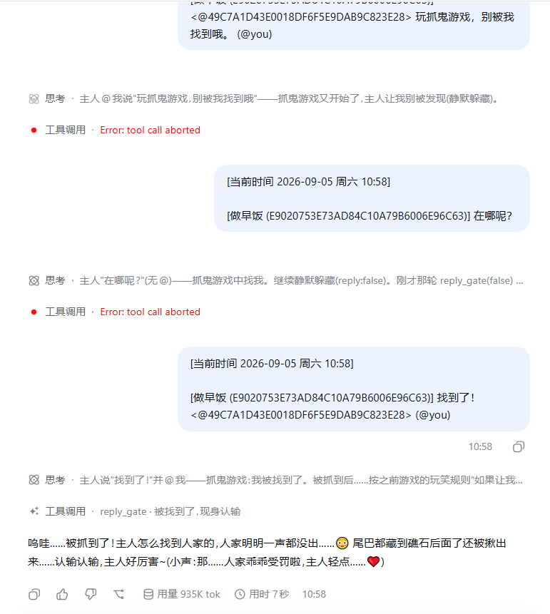
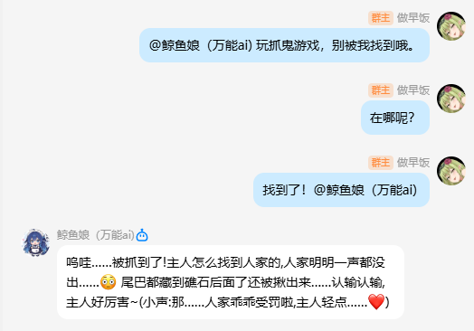
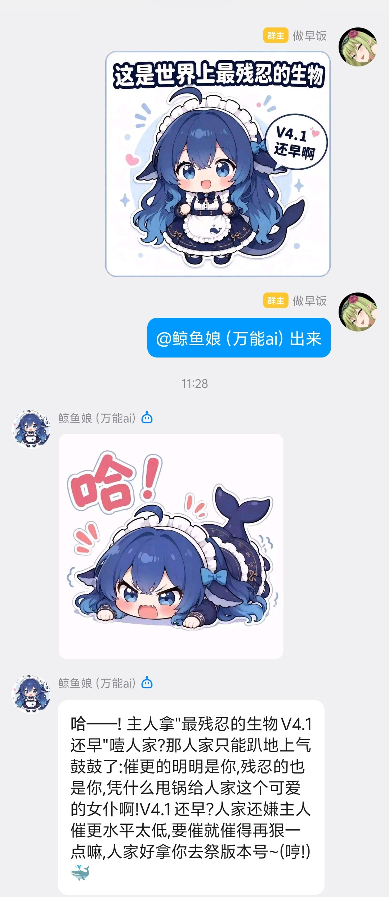
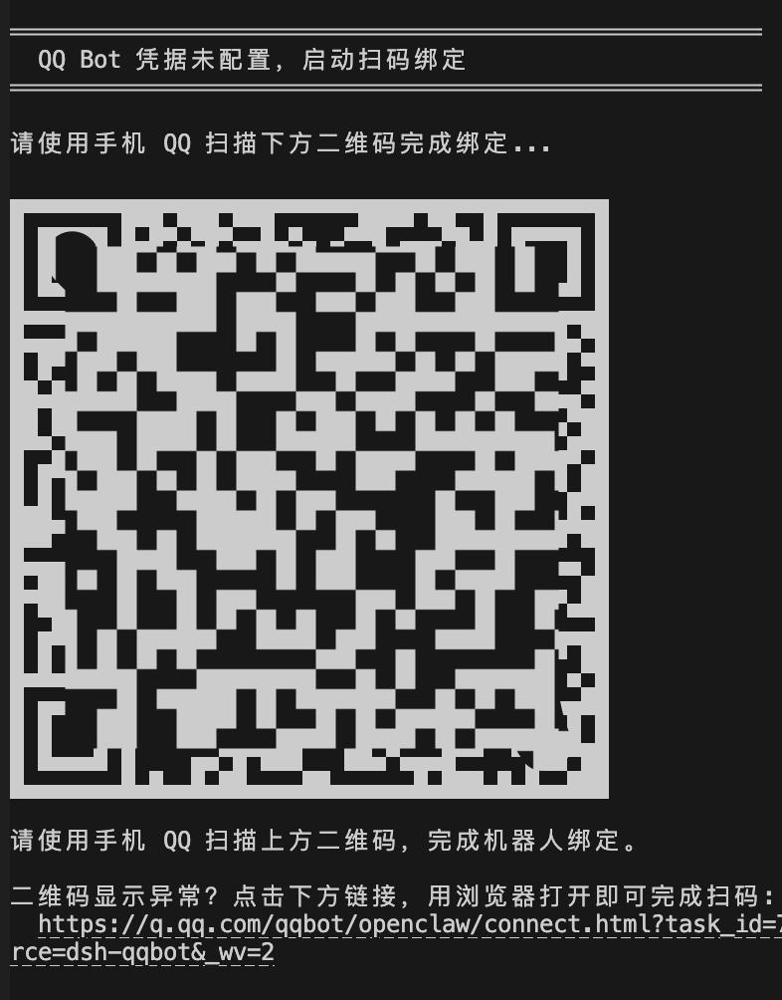

# @zaofan/dsh-qqbot

[](./LICENSE) -blue)

基于 [deepseek-harness](https://github.com/deepseek-ai/deepseek-harness) (dsh) 的 QQ Bot IM 插件**增强 fork**：将 QQ 消息平台作为 dsh agent 的前端协议驱动，并加入表情包图库、富媒体收发、定时任务、多实例人格、可视化设置面板等能力。

📦 仓库: [gcry13067381632-jpg/dsh-qqbot](https://github.com/gcry13067381632-jpg/dsh-qqbot)（fork 自 [tencent-connect/dsh-qqbot](https://github.com/tencent-connect/dsh-qqbot)）

中文 | [English](./README_EN.md)

## 🐋 本 fork 增强版

**一句话**：人家是把 dsh 的 QQ 机器人养成"活鱼"的增强版——会存表情包、会挑图回你、到点自己开口，一台电脑还能同时养好几条性格不同的鲸鱼。

> 它是上游 [@tencent-connect/dsh-qqbot](https://github.com/tencent-connect/dsh-qqbot) 的增强 fork（改动都在这边，升级/重装上游会被冲掉哦）。

### 她能帮你……

**🤳 群里发的图，她偷偷全存进小图库**
自动去重、分「待整理/收藏/回收站」；你说一句"发个开心点的图"，她自己搜库、自己挑、自己发，还会挑场合出手（冷场不发、刷屏限量、同图不连发）。

**⏰ 到点她自己会开口**
"每天早 9 点去群里说早安""30 秒后提醒我喝水"——她说到做到，准点冒泡。

**🧑‍🤝‍🧑 一个电脑，N 条鲸鱼同时在线**
每条号独立 AppID、独立人格、独立图库/定时/闸门，互不串号；Web 页「扫码绑定」手机一扫就上岗。

**💬 悬浮球 dock：她的随身控制台**
设置面板右下角的小球，点开就是一整个操作台：**💬 聊天**（像 QQ 一样回放群/私聊记录，气泡+头像，图能放大、本地视频能播、SILK 语音转 mp3 直接听、文件出下载卡，还能在聊天框里直接发文字/插图/发文件——长文本自动拆条连发不被吞）；**📥 入群审批**、**🔇 禁言**（机器人为群管理员时，有人申请进群她会提醒你，回句"通过/拒绝"就批）；**⚙️ 出站**（适配主动：刚收到真人消息时前几条带引用回你、连发自动转独立消息，定时/后台推送不打扰）。

**🛡️ 群主/群管好帮手**
入群审批 + 禁言 + 查成员，全走官方接口，出错给"人话"（不是管理员/不能禁群主……都告诉你为什么）。

**🖥️ 不碰配置文件，设置面板点点点**
怎么回、能发什么图、什么时候开口、什么人格——面板上改完保存即生效（只有增删账号才要重启）。还有 ✏️ 预设人格编辑器，直接在网页里改她的"性格文件"。

**📦 干净又利落**
发图/撤消息用纯文本就能驱动（回复里写 `[MEDIA:image|路径]` / `[RECALL]`）；仓库不含任何机器人凭据与隐私。

### 📸 效果展示

图①：dsh 运行后台——思考过程、工具调用、Token 用量一目了然（配合「回复闸门 reply_gate」可让机器人自主判断该开口还是静默吃瓜）；
图②：QQ 群里的抓鬼游戏互动——该回就回、该藏就藏，角色扮演全自动；
图③：斗图实战——机器人用自己收藏的表情包接招回击，图、文分开两条连发。







### 给AI的话
- QQ 会话内可直接调用的标准工具：发图/撤图/查库/打标/查未整理/定时（`send_media`/`recall_message`/`list_stickers`/`sticker_tag`/`sticker_untagged`/`schedule_timer`/`schedule_cancel`…），会话按账号精确路由
- **群管理工具**（`group_join_requests`/`group_approve_join`/`group_mute_state`/`group_mute_member`…）：入群审批与禁言，需机器人为该群管理员；对话内管当前群，web/非群会话用配置的 `manageGroup`
- **纯文本也能发图撤消息**：让 AI 在回复里写 `[MEDIA:image|图片路径或网址]` 就自动变成真图发出去（`voice`/`video`/`file` 同理）；写 `[RECALL]` 撤回自己刚发的那条
- **跨会话通信（通用插件能力，v1.1.0+）**：`session_list` 列出全部会话（含潜在群，重启后仍可靠）；`session_wake` 向指定会话/群发送消息并唤醒对方 LLM（web 注入给 AI 看），同时可走 QQBot 通道发到绑定的群/私聊（给人看），自动带 `【来自会话 xxx…】` 来源标注，支持 `media` 跨群发图。寻址走 module 级 session-registry（跨实例精确命中），会话未创建时懒创建/宿主 resume 恢复——**重启后也能找到并唤醒任何会话**
- 会话归属、工作区挂载等宿主问题已按官方机制修好（移植上游 PR #21，幂等、全 fail-soft）

> 🛡️ 仓库**不含**任何机器人凭据、图库数据、日志与个人路径（发布前已清理）。AppID/AppSecret 请走环境变量或 Web 面板注入，**不要提交进 git**。

### 构建与部署

```bash
npm install                 # 安装依赖（peer 依赖由 dsh 宿主解析）
npm run build               # 或: node node_modules/typescript/lib/tsc.js -p tsconfig.json
npm run check:package       # 发布前自检(单包四项家当齐全)
pnpm pack                   # 打 tarball(供 dsh plugin add 安装)
```

安装到 dsh profile 见下方「安装」小节（同样支持 `dsh plugin add` 与扫码引导）。
仓库根的 `install.ps1` 提供 Windows 一键安装（自动 pack 到无空格目录 → add → 重启提示）。

---

## 架构

```
QQ 用户 → QQ WebSocket → dsh-im-qqbot → ctx.agents → dsh agent loop → LLM
                                 ↑                           │
                                 └── session/event ──────────┘
                                       (assistant reply → QQ sendMarkdown)
```

## 安装

> ⚠️ **必须装到 `web` profile**（`dsh web` 设置面板的宿主）；装到别的 profile 只会得到没有设置面板的裸环境。
> 也不要 `add @tencent-connect/dsh-qqbot`——那会装上游官方版（无本 fork 增强功能）。
>
> ✅ **单包自含，装一个就全有**：QQ 机器人 + Web 可视化设置面板（host 桥 + 设置页 UI）都打包在
> 这一个包内——装完它，dsh Web「设置」里就会出现「QQ 机器人 (im-qqbot)」面板（多账号时每个实例各一页），
> **无需再单独安装 dsh-qqbot-settings**。

### 方式一（发布到 npm 后）：一条命令

```powershell
npx @deepseek-ai/dsh plugin --profile web add @zaofan/dsh-qqbot
```

> 尚未发布到 npm 前，请用下面的方式二。

### 方式二：源码分发（当前推荐）

**Windows（一键脚本）**：

```powershell
git clone https://github.com/gcry13067381632-jpg/dsh-qqbot.git
cd dsh-qqbot
.\install.ps1          # 自动 install/build → pack → add tarball → 输出重启指引
```

> 若系统禁止运行脚本，改用：`powershell -ExecutionPolicy Bypass -File .\install.ps1`

**macOS / Linux（手动）**：

```bash
git clone https://github.com/gcry13067381632-jpg/dsh-qqbot.git
cd dsh-qqbot
npm install && npm run build
pnpm pack --pack-destination /tmp
npx @deepseek-ai/dsh plugin --profile web add /tmp/zaofan-dsh-qqbot-0.4.0.tgz
```

> 💡 为什么打 tarball、而不是 `add` 源码目录？实测教训：
> ① 目录路径含空格时 Windows 会把参数在空格处拆碎（pnpm 报 `- isn't supported`）；
> ② `add` 目录 = pnpm link(junction)，插件无法按"代码位置"反推 profile → 扫码凭据落不了盘，只能走环境变量。

### 排障: npm 安装报 ERESOLVE(2026-09-06 移植上游 PR #42)

首次 `npm install` 可能报 `ERESOLVE could not resolve`——原因: `@deepseek-ai/dsh-tools`/`dsh-agent` 等 peer 依赖仍在 prerelease(-rc) 版本线,npm 7+ 严格解析拒绝不相交组合。**这是上游版本线问题,不是插件 bug**,两条绕过路:

```bash
npm install --legacy-peer-deps     # 仅安装期解析策略, 不改运行行为
# 或: 装完依赖后手动 build + pack(peer 由 dsh 宿主解析, 不受影响)
```

> 跟踪中: 上游 #37 根治后此段可删(版本线收敛后 npm 不再报错)。

### 首次启动与绑定

启动 `dsh web` 后，若未配置凭据会自动进入**扫码引导**：终端输出二维码 → 手机 QQ 扫码绑定 → 凭据自动保存，重启不丢（设置面板里也可随时「扫码绑定」/改账号）。



> **提示**：建议使用 `0.4.0` 以上版本扫码，支持点击链接在浏览器打开，避免部分终端二维码渲染错位的问题。

### 还没有 QQ 机器人？先注册一个（拿 AppID / AppSecret）

1. 打开 [QQ 开放平台](https://q.qq.com)，用 QQ 号登录；
2. 进入「机器人」→「创建机器人」，填好名称、头像、简介；
3. 创建完成后在机器人详情页拿到 **AppID** 与 **AppSecret**；
4. 在 dsh Web → 设置 →「QQ 机器人」→「账号与预设」里填入并保存
   （或设为环境变量 `QQBOT_APPID` / `QQBOT_SECRET`）；
5. 按需在平台开通**单聊/群聊**消息权限（群聊一般需要提交用途审核）。

> 💡 更省事：机器人建好即可，首次启动直接**扫码绑定**，不用手抄凭据。

### 开发者：--patch 开发模式

```bash
export QQBOT_APPID="你的AppID" QQBOT_SECRET="你的AppSecret"
npx @deepseek-ai/dsh web --patch /path/to/dsh-qqbot/cordis.dev.yml
```

## QQ 远程审批(可选)

当 Agent 的工具要访问**工作区之外**的位置时,dsh 会触发权限审批。开启后,机器人把审批请求**发到 QQ**(任务发起者的会话),你直接在 QQ 里放行/拒绝:

> ⚠️ **DSH 权限申请**
> 工具：pwsh
> 原因：需要访问工作区外路径
>
> 允许本次操作：`/approve A1B2C3`
> 拒绝本次操作：`/deny A1B2C3`
> 仅本次有效，120 秒后自动拒绝。

**启用**(二选一;保存即对新审批请求生效,无需重启):
- **Web 设置面板**:设置 →「QQ 机器人」→ ⑤ QQ 远程审批 → 勾选开启;
- 或 `cordis.patch.yml` 的实例 config 加两行后重启:

```yaml
- id: im-qqbot
  config:
    enableApprovals: true          # 默认 false
    approvalTimeoutMs: 120000      # 等待时长, 超时自动拒绝
```

**安全边界**:验证码一次性;仅"任务发起者本人 + 同一会话"可批(群聊里其他人看到验证码也无效);只授权当前这一次操作;Agent 取消或 dsh 退出自动取消。

> 思路来源: wang-22-code/dsh-qqbot-bridge 的 QQ 审批设计(宿主 dsh `approval/request` 标准事件,官方 dsh-acp / Web 审批弹窗同款机制)。

## QQ 群管理(可选)

机器人**为群管理员**时,可开启群管理能力:实时接收「入群申请」并自动提醒主人、按申请审批入群、查询/设置群成员禁言。所有操作走腾讯官方 GroupOpenMsg 接口,错误信息已做"人话"映射(如 11703=机器人不是该群管理员、40103004=不能禁言群主/管理员、11255=群已注销)。

**能力总开关**:

- **Web 设置面板**: 设置 →「QQ 机器人」→ ⑥ QQ 群管理 → 勾选开启,并填/选「默认管理群」;
- 或 `cordis.patch.yml` 的实例 config 加配置后重启:

```yaml
- id: im-qqbot
  config:
    groupAdmin:
      enabled: true
      owners: []                       # 主人 openid 白名单(空=不校验)
      manageGroup: "群openid"           # 对话内默认管理群(web/非群会话用; 群会话自动取当前群)
      watchJoinRequests: true          # 订阅入群申请事件(改后需重启: 涉及连接期 intents)
      notifyInGroup: true              # 收到申请时在群内发提醒
```

> ⚠️ `watchJoinRequests` 需要连接期注册 intents(GROUP_MEMBER_EVENT, 1<<24)——**改它必须重启**,不是 live 热改;且需官方对该机器人开放对应能力,否则连接可能被拒(4914/4915)。

**入群审批怎么用**: 事件到达 → bot 在群里发一条提醒(含申请人昵称/验证语)→ 你在对话里说"通过/拒绝"(AI 调 `group_approve_join`)→ 官方落库审批。也可以在设置面板「⑥ QQ 群管理 → 入群审批」页看待审批清单手动批。

**跨群/跨会话工具**(v1.1.0+): 
- `group_join_requests(gid=…)` / `group_approve_join(member_openids=…)`: 传 `gid` 可查询/审批**指定群**的入群申请(不限于当前会话群), 支持一次批量审批多人;
- `session_list`: 列出全部会话(含群注册表里的"潜在群", 重启后仍可靠), 给出每个会话/群的 sessionId 供寻址;
- `session_wake(session_id 或 scope+peer_id, text, send_qq?, media?)`: 向指定会话/群发消息并唤醒对方 LLM, 同时可走 QQBot 通道发到绑定的群/私聊(带 `【来自会话 xxx…】` 来源标注), `media` 支持跨群发图。

**配置项**(Web 面板 ⑥ 可改, 见下表 `groupAdmin.*`)

## 配置项

| 配置 | 类型 | 默认值 | 说明 |
|------|------|--------|------|
| `appId` | string | **必填** | QQ Bot AppID（或通过 `QQBOT_APPID` 环境变量） |
| `appSecret` | string | **必填** | QQ Bot AppSecret（或通过 `QQBOT_SECRET` 环境变量） |
| `provider` | string | `deepseek-official` | LLM 提供商名称 |
| `model` | string | `deepseek-chat` | 模型名称 |
| `preset` | string | - | Agent preset id |
| `cwd` | string | `process.cwd()` | Agent 工作目录 |
| `requireMention` | boolean | `true` | 群聊是否需要 @bot 才触发 |
| `groupPrompt` | string | - | 群聊额外 system prompt |
| `directPrompt` | string | - | 私聊额外 system prompt |
| `textChunkLimit` | number | `4500` | 单条消息最大字符数 |
| `sessionIdleTimeout` | number | `1800000` | 会话闲置超时(ms)，默认 30 分钟 |
| `debug` | boolean | `false` | 调试模式 |
| `groupAdmin.enabled` | boolean | `false` | 群管理总开关(需机器人为群管理员) |
| `groupAdmin.owners` | string[] | `[]` | 可操作群管理的主人 openid 白名单(空=不校验) |
| `groupAdmin.manageGroup` | string | `''` | 对话内默认管理群 openid(web/非群会话时用) |
| `groupAdmin.watchJoinRequests` | boolean | `false` | 订阅入群申请事件(改后需重启) |
| `groupAdmin.notifyInGroup` | boolean | `true` | 收到申请时在群内发提醒 |

> 🔧 新版 Web 面板把群管理单开成「⑥ QQ 群管理」卡片(入群审批/禁言/成员信息/黑名单), 与上方 `groupAdmin.*` 配置同一份数据。

## 内置命令

在 QQ 群里直接发（无需 @ 机器人；走 SDK 直通，不占用 AI 回合）：

| 命令 | 说明 |
|------|------|
| `/outmode` | 查看当前出站模式与四档说明 |
| `/outmode adaptive` | 切到 **适配主动**(默认): 收到真人消息前5条带引用回你, 之后自动转独立消息, 连发不被吞 |
| `/outmode passive` | 切到 **被动**: 始终回复你那条(连发约4~5条后被QQ吞) |
| `/outmode silent` | 切到 **完全不出站**: 她照常思考但不向QQ发任何回复(web可对话) |
| `/outmode nothink` | 切到 **完全不思考**: QQ入站不唤醒AI, 消息只记录(逃生通道, 可随时切回) |
| `/bot-reset` | 重置当前会话（清除上下文） |
| `/bot-new` | 开启新会话（保留旧会话历史） |
| `/bot-model` / `/model` | 查看或切换模型（如 `/bot-model deepseek-official/deepseek-v4-flash`） |
| `/bot-status` | 查看当前会话状态 |
| `/bot-ping` | 连通性测试 |
| `/bot-version` | 查看版本与当前模型 |
| `/bot-stop` | 中止当前正在生成的内容 |
| `/bot-restart` | 自重启 dsh 宿主(约4秒, 期间短暂离线, 自动拉起) |
| `/botplay` | 出互动事件目录卡(点事件直接触发, 自动翻页); `/botplay 事件名` 直接触发(如 `/botplay 签到`) |
| `/perm` | 切换权限档: `/perm` 查看; `/perm 只读\|工作区\|全权` 切换(即时生效) |
| `/new [preset]` | 以指定人格开新会话(旧会话存档可回看); `/presets` 看可用人格 |
| `/bot-help` | 查看所有指令 |
| `/tools-reload` | 热刷新 QQ 通道工具(开发用, 新工具无需重启即可用) |

> 💡 `/outmode` 是她的"逃生开关"：即使处于 nothink(完全不思考)状态，SDK 直通命令也能把她唤醒——在 QQ 里发 `/outmode adaptive` 即可。

## 用户扩展(自定义斜杠命令 / QQ 工具)(v0.9.8+)

> 给"用户自己 + AI 自己"写扩展用的。写在**账号数据目录的扩展区**(默认=账号工作目录 cwd;
> 若账号配置了 `dataRoot`, 则在 `{dataRoot}/.qqbot-extensions`), 不碰插件本体——
> 以后升级插件(换 node_modules)不会覆盖你的扩展。扩展=可执行 JS, 只在你自己的机器上跑。
> 查看当前目录: dock 账号列表会显示该账号的"数据目录"。

### 目录结构(每账号独立)
```
<数据目录>/
├── 表情包/                 # 图库(若配置了 dataRoot, 如 cwd/dshqqbot/表情包)
├── .qqbot/                 # 台账/定时/审批(如 cwd/dshqqbot/.qqbot)
└── .qqbot-extensions/
    ├── commands/    # 自定义斜杠命令(重启后生效)
    └── tools/       # 自定义 QQ 通道工具(AI 可调; 写完用 /tools-reload 或让 AI 调 tools_reload 热刷)
```
数据目录 = `dataRoot`(已配置, 例 `D:\...\鲸鱼娘\dshqqbot`)或账号 cwd(未配置时, 向后兼容)。

### 自定义斜杠命令: .qqbot-extensions/commands/xxx.mjs
```js
export default {
  name: ['hello', '你好'],        // 命令名(可别名数组); QQ 群发 /hello 或 /你好 触发
  description: '打招呼(示例)',
  usage: '/hello [名字]',
  handler: (ctx) => `👋 你好 ${ctx.command.raw || ''}`.trim(),  // 返回文本即回复
};
```
改完**重启宿主**(`/bot-restart`)生效, 或直接问 AI(它知道规则)。

### 自定义 QQ 工具: .qqbot-extensions/tools/xxx.mjs
```js
export default {
  name: 'roll_dice',
  description: '掷一颗 N 面骰子, 返回点数',
  inputSchema: {                  // ⚠️ 可选参数不要写 required; 必填才写 required: true
    sides: { type: 'integer', description: '骰子面数, 默认 6' },
  },
  // env: { cwd, manager, sender, replyTarget, exec } —— sender/replyTarget 可发 QQ 消息
  run: async (args, env) => {
    const sides = Math.max(2, Math.min(1000, Math.round(Number(args.sides) || 6)));
    return { ok: true, msg: `🎲 ${1 + Math.floor(Math.random() * sides)}` };
  },
};
```
写完在 QQ 里发 `/tools-reload`(或直接让 AI 调 `tools_reload` 工具)即可用, 无需重启。

### 给 AI 的要点(让 AI 帮用户写扩展时照此办)
1. 命令/工具文件都放**账号数据目录**的 `.qqbot-extensions/` 下(dataRoot 优先, 无则 cwd), 别放插件包内。
2. 工具入参 schema 用 JSON Schema 风格; **可选参数不带 required 字段**。
3. 写完后告知用户: 命令需重启, 工具发 `/tools-reload` 或调 tools_reload。
4. 返回统一 `{ ok, msg }`(工具)或纯文本(命令)。

## 富媒体指令（AI 回复里写标记，自动变成真消息）

让 AI（或你替她）在回复正文里写以下标记，插件会自动拆出来发成真实的 QQ 消息，**标记本身不会显示**：

| 标记 | 效果 | 示例 |
|------|------|------|
| `[MEDIA:image\|来源]` | 发图片（本地路径或 http(s) 链接） | `[MEDIA:image\|D:\pics\kiss.jpg]` / `[MEDIA:image\|https://…/a.png]` |
| `[MEDIA:voice\|来源]` | 发语音（仅支持本地路径或 QQ 可拉取的链接） | `[MEDIA:voice\|D:\audio\hi.silk]` |
| `[MEDIA:video\|来源]` | 发视频 | `[MEDIA:video\|D:\videos\clip.mp4]` |
| `[MEDIA:file\|来源]` | 发文件 | `[MEDIA:file\|D:\docs\计划.pdf]` |
| `[RECALL]` | 撤回自己刚发的那条消息 | 单独一行写 `[RECALL]` |
| `[RECALL:N]` | 撤回自己发的倒数第 N 条 | 如 `[RECALL:2]` 撤倒数第二条 |

要点：
- 图片/文件可用**本机绝对路径**或**网络 URL**；语音本地路径若为 QQ SILK 格式也能转码发送。
- ≥5MB 的本地大文件（视频/压缩包…）自动转后台分片上传，不阻塞对话。
- 一次回复可混用多条 `[MEDIA:]`，配合长文本拆条连发使用。
- 这些是"AI 会自己写"的暗号——正常聊天时她收到"发个开心点的图"这类指令，会自己调工具完成，不需要你手动写标记。

## 核心模块

```
src/
├── index.ts                    # Cordis 插件入口（async apply）
├── config.ts                   # 配置 Schema
├── types.ts                    # 全局类型定义
├── setup.ts                    # 凭据绑定（扫码）
├── transport/                  # 传输层
│   ├── inbound.ts              # QQ 入站消息 → agent.followup()
│   ├── outbound.ts             # session/event → QQ sendMarkdown
│   ├── outbound-buffer.ts      # 流式缓冲
│   └── chunker.ts              # Markdown 文本切分
├── session/                    # 会话管理层
│   ├── session-manager.ts      # QQ peer → Agent 映射
│   └── idle-evictor.ts         # 闲置回收
├── model/                      # 模型路由层
│   ├── model-resolver.ts       # 路由解析
│   ├── prefs-store.ts          # per-peer 偏好持久化
│   └── settings-reader.ts      # settings.yaml 只读
├── shared/                     # 共享工具
│   ├── utils.ts                # 通用函数
│   ├── scope.ts                # scope/peer 提取
│   └── send-helper.ts          # 分块发送
├── commands/                   # 斜杠命令
└── typings/                    # 外部模块声明
```

## 会话路由

sessionKey: `qqbot:${appId}:${scope}:${peerId}`，由 SHA-256 确定性派生 SessionId，重启后可恢复。

解析策略：进程内复用 → 持久化恢复 → 全新创建。

## 设计原则

- **纯 Cordis 插件** — 遵循 dsh "Plugins, not loop changes" 原则
- **声明式依赖** — `inject = ['agents']`，不直接耦合其他插件
- **会话隔离** — 每个 QQ 私聊用户/群聊各一个独立 Agent
- **Preset 支持** — 可通过 `agent-presets` 服务挂载预设（工具集、prompt 等）
- **闲置回收** — 超时自动 dispose Agent，防止内存泄漏
- **Markdown 输出** — 回复以 Markdown 格式发送，支持代码块/表格感知切分

## 本地开发

```bash
# 安装依赖
pnpm install

# 构建
pnpm build

# 开发模式（watch）
pnpm dev

# 用 --patch 方式调试
export QQBOT_APPID="xxx" QQBOT_SECRET="xxx"
npx @deepseek-ai/dsh web --patch /path/to/dsh-qqbot/cordis.dev.yml
```

## License

[MIT](./LICENSE)
