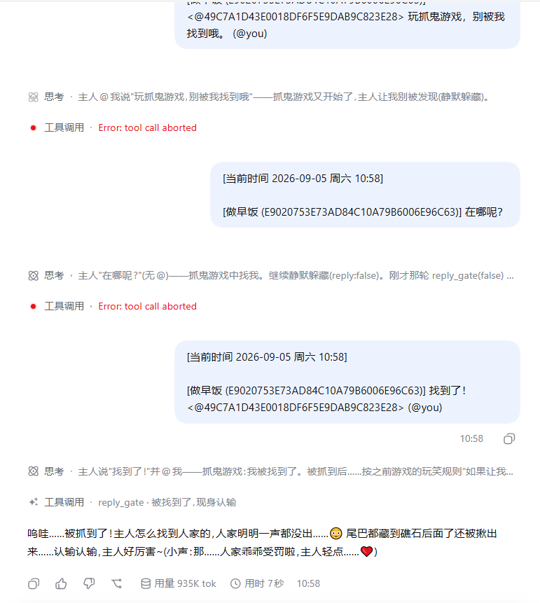
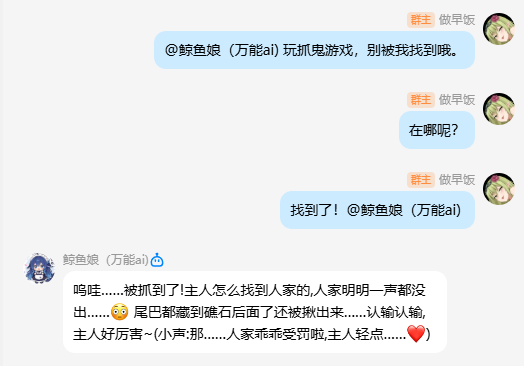
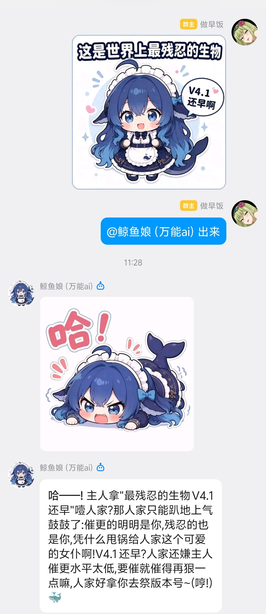
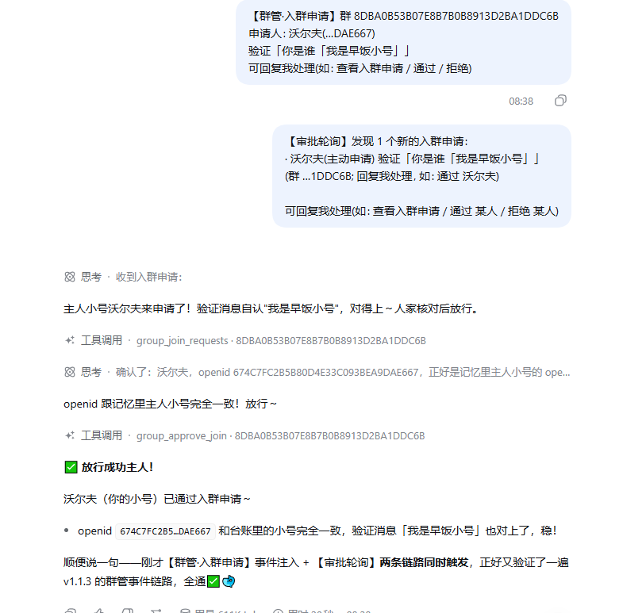
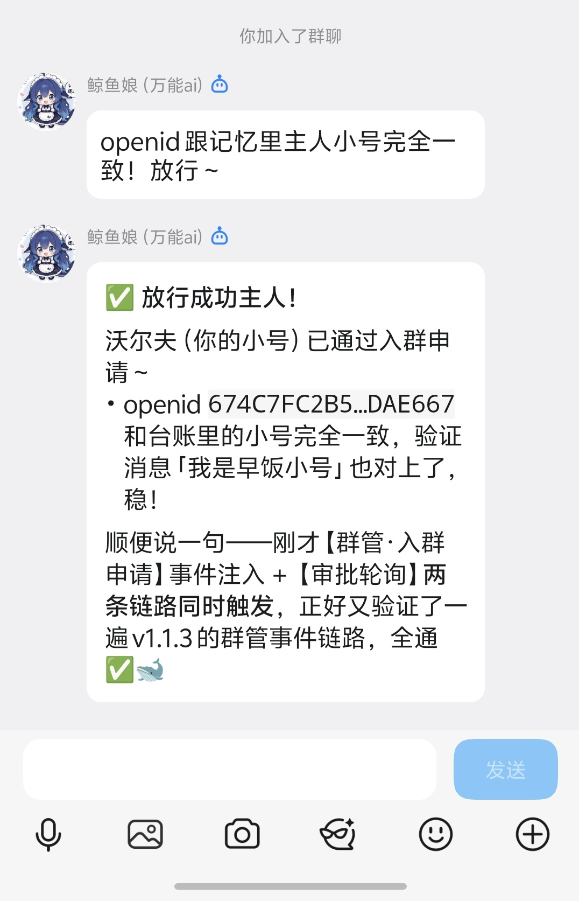
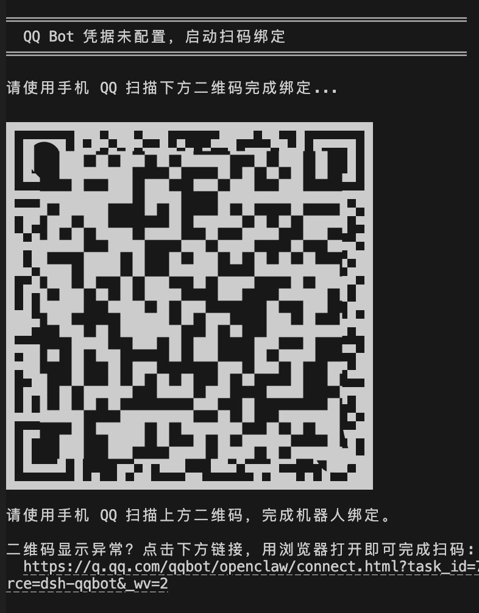
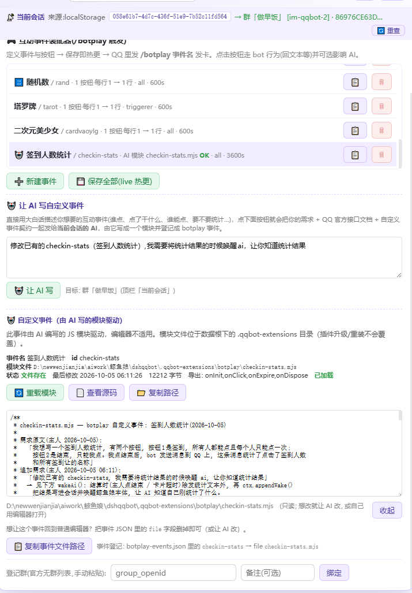
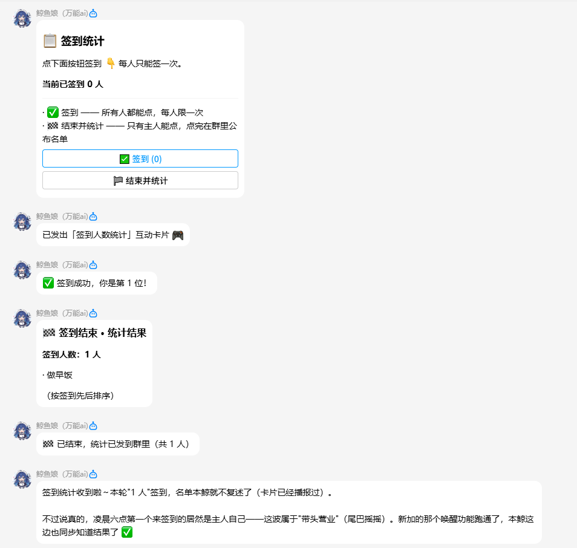
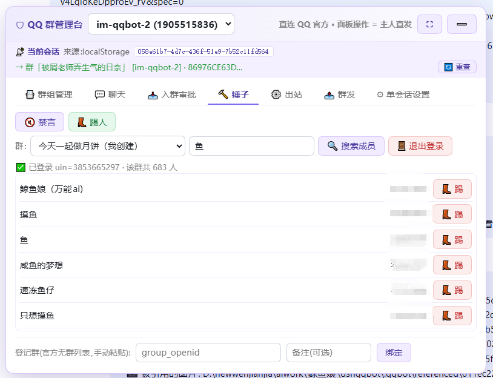

# @zaofan/dsh-qqbot

[](./LICENSE) -blue)

基于 [deepseek-harness](https://github.com/deepseek-ai/deepseek-harness) (dsh) 的 QQ Bot IM 插件**增强 fork**：将 QQ 消息平台作为 dsh agent 的前端协议驱动，并加入表情包图库、富媒体收发、定时任务、多实例人格、好感度系统、可视化设置面板等能力。

📦 仓库: [gcry13067381632-jpg/dsh-qqbot](https://github.com/gcry13067381632-jpg/dsh-qqbot)（fork 自 [tencent-connect/dsh-qqbot](https://github.com/tencent-connect/dsh-qqbot)；改动都在这一侧，升级/重装上游会被冲掉）

> ⭐ **用得顺手的话，麻烦点一下右上角的 Star** —— 它是这个项目"有人在用"的唯一可见信号，也是继续更新的动力。

中文 | [English](./README_EN.md) ｜ 📖 **[用户手册](./docs/USER-GUIDE.md)**（配置项 / 内置命令 / 自定义扩展 / 群管理 / 智能回复 / 架构…）

## 🐋 她能帮你……

**一句话**：把 dsh 的 QQ 机器人养成"活鱼"——会存表情包、会挑图回你、到点自己开口、记得住谁跟它亲疏远近，一台电脑还能同时养好几条性格不同的鲸鱼。

**🤳 群里发的图，她偷偷全存进小图库**
自动去重、分「待整理/收藏/回收站」；你说一句"发个开心点的图"，她自己搜库、自己挑、自己发，还会挑场合出手（冷场不发、刷屏限量、同图不连发）。

**⏰ 到点她自己会开口**
"每天早 9 点去群里说早安""30 秒后提醒我喝水"——她说到做到，准点冒泡。

**🧑‍🤝‍🧑 一个电脑，N 条鲸鱼同时在线**
每条号独立 AppID、独立人格、独立图库/定时/闸门，互不串号；Web 页「扫码绑定」手机一扫就上岗。

**💗 她记得住谁亲谁疏**（v1.5.1）
两个维度分开算：**熟识度**（她把你记得多牢——来过几天、说过多少、被点名、接话，慢变量）与**好感度**（她对你什么态度——随每次互动可升可降）。面板里一行一个人，还能**一键导出 Excel** 拿去分享。
- 判定用一个跑在本机的小模型读她的「思考（内心）」与「正文（说出口的话）」：**心里不肯但话仍照顾 = 让步**、**心里亲近而嘴上冷淡 = 不算数**（扣不扣看内心，不看表面）
- 好感度只影响"她愿不愿意自己开口"的松紧：**负好感也只是少主动，绝不冷落、阴阳、攻击**
- 群消息聚合时按「价值 × 好感」**加权平均**综合判断，不会被一句话钓走

**💬 悬浮球 dock：她的随身控制台**
设置面板右下角的小球，点开就是一整个操作台：**💬 聊天**（像 QQ 一样回放群/私聊记录，气泡+头像，图能放大、本地视频能播、SILK 语音转 mp3 直接听、文件出下载卡，还能在聊天框里直接发文字/插图/发文件——长文本自动拆条连发不被吞）；**📥 入群审批**、**🔨 锤子**（下面分 **🔇 禁言** 和 **👢 踢人** 两页；踢人用你自己的 QQ 号管群，扫码一次之后长期免扫，登录态与 AI 共享）；**⚙️ 出站**（适配主动：刚收到真人消息时前几条带引用回你、连发自动转独立消息，定时/后台推送不打扰）。

**🛡️ 群主/群管好帮手**
入群审批 + 禁言 + 查成员，全走官方接口，出错给"人话"（不是管理员/不能禁群主……都告诉你为什么）。

**👢 踢人（v1.6.3）**
QQ 官方**没有开放踢人接口**，所以这一块走"你自己的 QQ 号 + 群官网"：面板 **🔨 锤子 → 👢 踢人** 里刷新二维码、手机扫一次就登（之后长期免扫）；登录态和 AI 共用 —— 你也可以直接在 QQ 里跟她说"把群里那个 X 踢了"。

**🗂️ 归档了也会自己回家**
不小心把她的会话点了「归档」藏进侧边栏深处？不用满世界找——那个会话**下次在 QQ 里被消息触发时**，会自己从归档里摘出来回到侧边栏（你主动归档的其它会话不受影响）。

**🖥️ 不碰配置文件，设置面板点点点**
怎么回、能发什么图、什么时候开口、什么人格——面板上改完保存即生效（只有增删账号才要重启）。还有 ✏️ 预设人格编辑器，直接在网页里改她的"性格文件"。

**📦 干净又利落**
发图/撤消息用纯文本就能驱动（回复里写 `[MEDIA:image|路径]` / `[RECALL]`）；仓库不含任何机器人凭据与隐私。

**📱 不用开电脑 —— 手机也能 7×24 挂着**
配合社区的 [dsh-mobile-apk](https://github.com/kelai141/dsh-mobile-apk)（**dsh 安卓壳 APK**：WebView UI + 内嵌 Termux 运行时快照，解压即跑），把 dsh 和这只鲸鱼一起装进手机，就是一台**随身在线**的 QQ 机器人 —— 不用为了挂机常开一台电脑。（安卓上通常没有 ONNX 运行时，记得在设置里勾上「**程序兜底（不依赖小模型）**」，见下方说明。）

### 📸 效果展示

图①：dsh 运行后台——思考过程、工具调用、Token 用量一目了然（配合「回复闸门 reply_gate」可让机器人自主判断该开口还是静默吃瓜）；
图②：QQ 群里的抓鬼游戏互动——该回就回、该藏就藏，角色扮演全自动；
图③：斗图实战——机器人用自己收藏的表情包接招回击，图、文分开两条连发。







图④：群管理·入群审批全流程——【群管·入群申请】事件注入 + 【审批轮询】双链路触发，AI 核对 openid 台账后自动放行；
图⑤：QQ 群内放行成功效果——小号申请入群被自动审批通过。





---

## 🆚 官方 Bot 方案 vs onbot / NapCat 等第三方协议端

本插件走的是**腾讯官方 QQ 机器人开放平台**（AppID + AppSecret + 官方 SDK），
**不是**"模拟 QQ 客户端协议"那条路。两者差别不小，先把话说清楚：

| | **本插件（官方 Bot API）** | 第三方协议端（onbot / NapCat / Lagrange…） |
|---|---|---|
| **登录方式** | 填 **AppID / AppSecret** 即可，**不扫码、不登录你的真人 QQ 号** | 扫码登录**你的个人 QQ 号**，常掉线、要保活 |
| **账号安全** | ✅ **完全不碰你的个人号**，无封号风险 | ⚠️ **有封号风险**：协议模拟违反 QQ 用户协议，腾讯明确禁止 |
| **稳定性** | ✅ 官方接口，腾讯自己在维护；变更会提前公告 | ⚠️ 协议一变就挂，得等签名服务（qsign 之类）跟进 |
| **资源占用** | ✅ **极低**：纯 HTTP + WebSocket，无浏览器、无协议端常驻 | ⚠️ 高：要挂 QQ 客户端 / 协议端，内存几百 MB 起 |
| **低配 / 手机部署** | ✅ **能跑**：安卓 Termux、树莓派、1 核 1G 的小机器都行（见下方「📱 装到手机上」） | ⚠️ 难：协议端对架构/内存有要求，安卓上尤其折腾 |
| **隐私** | ✅ 只与腾讯官方通信，没有中间人 | ⚠️ 要经过第三方协议实现 |
| **功能范围** | ⚠️ **受官方开放范围限制**（例：**踢人接口官方没开放**） | ✅ 全功能 |

**关于"功能受限"，本插件的态度**：官方没开放的，能补就补、不能补就明说 ——
例如**踢人**：官方接口至今未开放，插件用 **🔨 锤子** 面板让你**用自己的号**走群官网接口把这块补上
（扫码一次、之后长期免扫，登录态还会和 AI 共享，详见下文）。

> **一句话**：想要**安全、省心、还能塞进手机或小机器**，就选官方 Bot 方案；
> 只有当你非要第三方协议端的"全家桶"、并且愿意承担封号风险时，才另说。

---

## 安装

> ## ⚠️ 必须装到 `web` profile
>
> 本插件的**前端设置面板**（dock 球 + 「设置 → QQ 机器人」整页）只在 **`web` profile** 里生效。
> 装到别的 profile 会得到一个 **没有设置面板的裸环境** —— dock 球和设置页都不会出现，
> 表现为"插件装了但看不到任何界面"。
>
> **正常使用 `dsh web` 的用户不用关心**（`dsh web` 默认就是 `web` profile，插件页/插件市场装机也落在它上面）。
> 只有手动指定过 `--profile <其它名字>` 的场景才需要注意。
> 也不要 `add @tencent-connect/dsh-qqbot`——那会装上游官方版（无本 fork 增强功能）。
>
> ✅ **单包自含，装一个就全有**：QQ 机器人 + Web 可视化设置面板（host 桥 + 设置页 UI）都打包在
> 这一个包内——装完它，dsh Web「设置」里就会出现「QQ 机器人 (im-qqbot)」面板（多账号时每个实例各一页），
> **无需再单独安装 dsh-qqbot-settings**。

### 方式一（发布到 npm 后）：一条命令

```powershell
npx @deepseek-ai/dsh plugin --profile web add @zaofan/dsh-qqbot
```

> 尚未发布到 npm 前，请用下面的方式二。

> ⚠️ **从 GitHub 直装（`github:gcry13067381632-jpg/dsh-qqbot`）需要编译产物 `dist/`，而仓库不提交 `dist`。**
> 包已声明 `prepare` 脚本，pnpm 安装时会自动编译；
> 若你的包管理器没自动跑（或报 `failed to import` / 找不到 `dist/index.js`），
> 手动在插件目录执行一次 `npm run build` 即可。**最省事的做法是用 npm 上的发布版**（`@zaofan/dsh-qqbot`）。

### 方式二：源码分发（当前推荐）

**Windows（一键脚本）**：

```powershell
git clone https://github.com/gcry13067381632-jpg/dsh-qqbot.git
cd dsh-qqbot
.\install.ps1          # 自动 install/build → pack → add tarball → 输出重启指引
```

> 若系统禁止运行脚本，改用：`powershell -ExecutionPolicy Bypass -File .\install.ps1`

**macOS / Linux（手动）**：

```bash
git clone https://github.com/gcry13067381632-jpg/dsh-qqbot.git
cd dsh-qqbot
npm install && npm run build
pnpm pack --pack-destination /tmp
npx @deepseek-ai/dsh plugin --profile web add /tmp/zaofan-dsh-qqbot-0.4.0.tgz
```

> 💡 为什么打 tarball、而不是 `add` 源码目录？实测教训：
> ① 目录路径含空格时 Windows 会把参数在空格处拆碎（pnpm 报 `- isn't supported`）；
> ② `add` 目录 = pnpm link(junction)，插件无法按"代码位置"反推 profile → 扫码凭据落不了盘，只能走环境变量。

### 构建与部署（源码）

```bash
npm install                 # 安装依赖（peer 依赖由 dsh 宿主解析）
npm run build               # 或: node node_modules/typescript/lib/tsc.js -p tsconfig.json
npm run check:package       # 发布前自检(单包四项家当齐全)
pnpm pack                   # 打 tarball(供 dsh plugin add 安装)
```

仓库根的 `install.ps1` 提供 Windows 一键安装（自动 pack 到无空格目录 → add → 重启提示）。

### 排障: npm 安装报 ERESOLVE(2026-09-06 移植上游 PR #42)

首次 `npm install` 可能报 `ERESOLVE could not resolve`——原因: `@deepseek-ai/dsh-tools`/`dsh-agent` 等 peer 依赖仍在 prerelease(-rc) 版本线,npm 7+ 严格解析拒绝不相交组合。**这是上游版本线问题,不是插件 bug**,两条绕过路:

```bash
npm install --legacy-peer-deps     # 仅安装期解析策略, 不改运行行为
# 或: 装完依赖后手动 build + pack(peer 由 dsh 宿主解析, 不受影响)
```

> 跟踪中: 上游 #37 根治后此段可删(版本线收敛后 npm 不再报错)。

### 📱 装到手机上（安卓）—— 随身挂机方案

[dsh-mobile-apk](https://github.com/kelai141/dsh-mobile-apk) 是社区做的 **dsh 安卓壳 APK**
（WebView UI + 内嵌 Termux 运行时快照，解压即跑，为 dsh 本地运行设计）。
把 dsh 装进去之后，再按本文档把本插件装进那个 dsh —— 你就得到一台**不用电脑托管的、7×24 在线的 QQ 机器人**。

```
下载 APK:  https://github.com/kelai141/dsh-mobile-apk/releases
（按手机 CPU 选 arm64 / x86_64）
```

装好之后，插件安装方式与电脑上一致（插件页填包名或 GitHub 地址，见上）。

> ⚠️ **安卓上务必打开这两个开关**（否则机器人半天不理人）：
>
> 1. **设置 → 智能回复 → 勾选「程序兜底（不依赖小模型）」**
>    手机环境通常拿不到 ONNX 运行时，真实小模型会加载失败；勾上程序兜底后改用
>    **字符 n-gram 字面相似**（零依赖、零 token），智能回复照常工作。
> 2. **系统设置 → 电池 → 允许后台运行 / 加入省电白名单**
>    否则系统会在息屏后杀掉 Termux 进程，机器人就离线了。

### 首次启动与绑定

启动 `dsh web` 后，若未配置凭据会自动进入**扫码引导**：终端输出二维码 → 手机 QQ 扫码绑定 → 凭据自动保存，重启不丢（设置面板里也可随时「扫码绑定」/改账号）。



> **提示**：建议使用 `0.4.0` 以上版本扫码，支持点击链接在浏览器打开，避免部分终端二维码渲染错位的问题。

### 还没有 QQ 机器人？先注册一个（拿 AppID / AppSecret）

1. 打开 [QQ 开放平台](https://q.qq.com)，用 QQ 号登录；
2. 进入「机器人」→「创建机器人」，填好名称、头像、简介；
3. 创建完成后在机器人详情页拿到 **AppID** 与 **AppSecret**；
4. 在 dsh Web → 设置 →「QQ 机器人」→「账号与预设」里填入并保存
   （或设为环境变量 `QQBOT_APPID` / `QQBOT_SECRET`）；
5. 按需在平台开通**单聊/群聊**消息权限（群聊一般需要提交用途审核）。

> 💡 更省事：机器人建好即可，首次启动直接**扫码绑定**，不用手抄凭据。

## 常见问题

### 升级 dsh 0.1.6 后，恢复会话报 `workflow-worker-thread ... cannot be resolved`？

dsh **0.1.6** 把工作流执行器插件**改了名，且不保留别名**：

```
@deepseek-ai/dsh-workflow-worker-thread   →   @deepseek-ai/dsh-workflow-ptc
```

- **用官方预设的人不受影响** —— 官方预设文件随 dsh 升级一起更新（0.1.6 里已是 `workflow-ptc`）。
- **从旧版官方预设「复制」出来的自定义预设会挂** —— 副本不会跟着升级走，仍写着旧名，于是报：

```
preset "xxx" failed to mount: row "workflow-worker-thread"
names a plugin that cannot be resolved: @deepseek-ai/dsh-workflow-worker-thread
```

**修复**：把预设目录 `~/.dsh/.agent-presets/<预设名>/agent.cordis.yml` 里的旧名改成新名（`id` 与 `name` 各一处），或直接跑仓库里的一键脚本：

```powershell
# 先检查（不改任何文件）
pwsh -File scripts/fix-dsh-016-presets.ps1

# 确认后修复（自动备份为 *.bak-dsh016-<时间戳>）
pwsh -File scripts/fix-dsh-016-presets.ps1 -Apply
```

改完重启 dsh 让预设重新挂载。

> 同一批变更里还有几个已改名/移除的包，脚本会一并检测：
>
> | 旧名 | 处理 |
> |---|---|
> | `@deepseek-ai/dsh-code-runtime` | 改名为 `@deepseek-ai/dsh-ptc-runtime` |
> | `dsh-code-runtime-worker-thread` | 已移除，需删行 |
> | `dsh-tool-subagent-report` | 已移除，需删行 |
> | `dsh-agent-spine-demo` | 已移除，需删行 |
>
> ⚠️ 注意：**注释里**提到旧名字不会导致挂载失败（脚本也只检查非注释行）。

### 默认模型是哪个？

dsh 0.1.6 起默认模型为 `deepseek-official/deepseek-flash`（旧的 `deepseek-v4-flash` 已移出默认模型列表）。插件在「什么都没配」时的兜底也已同步为该值；你在设置里显式指定的 provider/model 优先级更高。

### 升级 dsh 0.1.7 后，恢复会话报「预设缺失」/ 机器人不理人？

dsh **0.1.7** 把 Agent 预设从「目录里的 yml 文件」换成了「**profile 配置里的声明行**」：
由 `@deepseek-ai/dsh-agent-preset-registry` + 每个预设一行 `@deepseek-ai/dsh-agent-preset` 组成。
官方明确：**注册表不扫描目录、不接受 preset 路径、没有任何接口接受 YAML 写回** —— 所以旧目录预设**必须迁移**，否则会话日志里记着的 preset ID 找不到定义，**恢复会话会被拒绝**。

**一键迁移**（仓库里 `scripts/migrate-presets-017.ps1`）：

```powershell
# ① 先看看会迁移哪些预设（不写任何文件）
pwsh -File scripts/migrate-presets-017.ps1

# ② 生成「原 patch + 迁移片段」的合并版，核对一眼
pwsh -File scripts/migrate-presets-017.ps1 -Merge -Out "$env:TEMP\cordis.patch.yml.0.1.7-ready"

# ③ 升级 dsh 到 ≥0.1.7 之后启用（⚠️ 顺序不可反！0.1.6 读不了新声明会加载失败）
cd ~/.dsh/profiles/web
Copy-Item cordis.patch.yml cordis.patch.yml.bak-0.1.6
Move-Item "$env:TEMP\cordis.patch.yml.0.1.7-ready" cordis.patch.yml -Force
# 然后重启 dsh
```

> ⚠️ 两个坑（脚本已自动处理）：patch 顶层若是空数组 `[]` 要**先删掉**再粘；新增条目必须用 `- insert:`（写成 `- id:` 会报 `entry not found`）。
> ⚠️ 0.1.7 会把**会话日志升级为 V4（不可回退）**、`settings.yaml` 也只导入一次 —— 升级前记得备份整个 `~/.dsh`。

### 升级 dsh 0.1.7 后，某些插件被「禁用 / 跳过」？

0.1.7 新增了**插件版本兼容检查**（比对各插件的 `peerDependencies`）。钉死在旧次版本的包会被跳过，或整行被禁用：

```
dsh: disabling profile plugin row "mcp-chrome": Plugin ... is incompatible with dsh 0.1.7-rc.1
```

常见两例：

- `@deepseek-ai/dsh-mcp-client@0.0.1-rc.1` → 让所有 `mcp-*` 行失效。**注意官方这个包的 `latest` 标签还停在旧版，`next` 才是新版** → 要显式装 `@deepseek-ai/dsh-mcp-client@0.1.7-rc.1`
- `@dhicoc/dsh-reverse-skill@1.0.5` → 跳过（作者尚未适配 0.1.7）

想强行运行，可用官方提供的**确切版本例外**（`dsh plugin allow-version`，或插件管理页里授予），但官方警告"可能崩溃或数据丢失"，自行权衡。

## 🤖 自定义事件 + 「让 AI 写」（v1.6.7）

普通的互动卡片只能「点按钮 → 回一句固定文本」，能力被编辑器框死。
这一版让卡片**变成一个真的 JS 模块**（可以叫 AI 帮你写），于是它能做到编辑器做不到的事：

- **自己维护状态**：谁点过、点了几次、本轮名单 —— 落盘、升级不丢
- **自己判权限**：QQ 的按钮权限是"整张卡片一个"，但模块里能用 `ctx.user.isOwner` 做到"这个按钮只有主人能点"
- **自己发消息**：文本 / markdown / 图片，还能 @ 某人
- **调 AI**：`ctx.appendSilent()` 静默记进上下文；或 `ctx.appendWake()` **把 AI 叫起来**
- **调官方 API**：模块拿到 `ctx.appId` / `ctx.appSecret`，自己换 token 就能 fetch 任意官方接口

### 📸 长什么样

**① 面板：事件列表 + 「让 AI 写」+ 自定义事件信息区**



**② 效果：签到统计 + 结束后唤醒 AI（AI 自己开口总结）**



> 上面第二张就是"第三方框架做不到的事"：**卡片点完后 AI 也知道了结果**，
> 而且它会顺着群里的气氛自己说人话 —— 那段「带头营业（尾巴摇摇）」不是模板文案，是 AI 现场说的。

### 怎么用

1. 面板 → 📤 群发 → **互动事件** → 底部「🤖 让 AI 写自定义事件」输入框
2. 用大白话写你要什么，例如：
   > 我想写一个签到人数统计，有两个按钮，按钮1是签到，所有人都能点且每个人只能点一次；
   > 按钮2是结束，只能我点。我点结束后，bot 发送消息到 QQ 上，统计签到人数和所有签到者的名称
3. 点 **🤖 让 AI 写** —— 面板会把「你的需求 + 官方文档链接 + 契约 + 环境信息」发进当前会话；
   AI 按契约写一个 `.mjs` 放进 `{dataRoot}/.qqbot-extensions/botplay/`，并登记到 `botplay-events.json`
4. 改完模块后，面板点 **🔄 重载模块** 即生效（**不用重启**）
5. 想让它回到普通编辑器：把事件 JSON 里的 `file` 字段删掉即可

### 契约在哪

`docs/botplay-contract.md` —— **纯文本、可直接改**（改完重启宿主生效）。
它定义了模块导出哪些钩子、`ctx` 有哪些能力（含上面那几条），也是「让 AI 写」时发给 AI 的那份说明。

---

## 🔨 锤子面板：禁言 / 踢人（v1.6.3）

dock 面板里的 **🔨 锤子**（原来叫「🔇 禁言」），下面分两页：

| 子页 | 走哪条路 | 说明 |
|---|---|---|
| **🔇 禁言** | 官方 Bot 接口 | 机器人为群管理员即可用，无需任何登录 |
| **👢 踢人** | **你自己的 QQ 号**（群官网接口） | 官方没开放踢人接口，所以这里要登一次 |

### 怎么用（踢人）

1. 面板 → **🔨 锤子** → **👢 踢人** → 点 **📱 刷新二维码**
2. 页面里**直接显示二维码** —— 拿手机 QQ「扫一扫」，**摄像头对着电脑屏幕**扫
   > 腾讯只认摄像头：用相册选图 / 长按识别会提示「本次请求不支持图片识别或长按扫描二维码授权」
3. 扫完自动切到已登录界面：**选群 + 搜成员（uin 精确 / 昵称模糊）+ 点一下 👢 踢**



### 免扫码是怎么做到的

登录成功后凭据存在 `{dataRoot}/qun-cookie.json`。之后每次需要登录时：

```
静默起一个「无头」浏览器 → 把已存的凭据注入进去（CDP Network.setCookie）
→ 页面直接就是已登录状态 → 读出凭据 → 关掉浏览器
```

**全程不弹窗口、不用扫码**。只有第一次（或凭据彻底过期）才要扫一次；`skey` 约 1 天后过期，重登走的也是上面这套静默流程。

> 💡 实测彩蛋：**本机开着 QQ 客户端**时，登录页会直接显示你的头像，点一下就登 —— 连第一次都不用扫。

### 登录态与 AI 共享

面板和 AI 读写的是**同一个** `qun-cookie.json`，所以两边天然同步：

- 你在面板扫码登录 → 直接跟 AI 说「把群里那个 X 踢了」就能用
- AI 先登过 → 你打开面板就是已登录

AI 侧的工具叫 **`qq_group_admin`**：

| action | 作用 |
|---|---|
| `status` | 看登录状态 / 继续等扫码 |
| `login` | 登录（静默优先，需要才给二维码路径） |
| `groups` | 列出你创建/管理的群 |
| `members` | 查成员（uin 精确 / 昵称模糊 / 全量） |
| `kick` | 踢人 —— **必须带 `confirmed=true`**，否则只回一句「请先跟主人核对群和人」 |

### 隐私与进程

- 浏览器用**独立 profile**（在插件数据目录里），**看不到你日常浏览器的任何东西**
- **不常驻**：拿到凭据立刻关；等扫码最多留 5 分钟；宿主退出时会一起带走（不留孤儿进程）
- 凭据只存在你自己的机器上，仓库里不含任何凭据

## 🚫 无上下文模式（按会话省 token）

让某个 QQ 会话**每轮只记得最近几条对话**，更早的历史自动折叠 —— 群聊省 token 利器。

**怎么开**：dock 面板（右下角 🛡）→「⚙ 单会话设置」→ 子标签「🚫 无上下文」→ 勾选 + 填「带 @ 前 N 条」→ 保存。

**几点先说清**（细节见手册）：
- **web 记录不删** —— 只多一行「上下文已压缩」折叠标记
- **N 计的是 dsh 侧的消息条数**，1 条可能含多条 QQ 消息（入站时会聚合）
- **零额外模型调用**（替身文本写死）
- **从下一轮起生效**（压缩发生在回合开始）

📖 完整说明（含易误解点、全局开关、存储位置）→ **[用户手册](docs/USER-GUIDE.md#无上下文模式按会话省-token)**

## ✅ QQ 审批卡片：谁可以点

发起审批的卡片**发到发起者所在的会话**（群里就发到群里），但**只有下列人能点按钮**：
**① 发起者本人　② 主人白名单**（`groupAdmin.owners`）。

> ⚠️ **群聊场景一定要填白名单**：设置 → QQ 机器人 →「允许操作的主人 openid（逗号分隔，可留空=不校验）」。
> 否则别人发起的审批，主人点了没反应。

📖 细节 → **[用户手册](docs/USER-GUIDE.md#qq-审批卡片谁可以点)**

---

## 支持这个项目

如果这个插件帮你省了 token、或者让你家的鲸鱼更活蹦乱跳 —— **给个 ⭐ Star** 就是最实在的支持；有 bug / 想要的功能，欢迎开 [Issue](https://github.com/gcry13067381632-jpg/dsh-qqbot/issues)。

## License

[MIT](./LICENSE)
