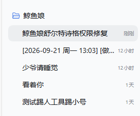

# dsh-qqbot 用户手册

> [@zaofan/dsh-qqbot](../README.md) 的**详细文档**：配置项、内置命令、自定义扩展、群管理（含 🔨 锤子：禁言 / 踢人）、本地小模型、好感度系统、数据文件与日志、升级排障、架构与本地开发。
> 只想看"它能干什么 + 怎么装" → 回 **[README](../README.md)**。

**章节**：给AI的话 · 架构 · QQ 远程审批 · QQ 群管理（含 🔨 锤子：禁言 / 踢人）· 智能回复（本地小模型）· **好感度与熟识度** · 配置项 · 数据文件与日志 · 内置命令 · 用户扩展 · 富媒体指令 · 核心模块 · 会话路由 · 升级与兼容 · 常见问题 · 设计原则 · 本地开发

> 📌 **版本**：本文对应插件 **v1.6.x**（含 1.6.2 → 1.6.5 的新功能与排障）。新增内容都标了版本与补充日期，便于你对照自己装的版本。

---

### 给AI的话
- QQ 会话内可直接调用的标准工具：发图/撤图/查库/打标/查未整理/定时（`send_media`/`recall_message`/`list_stickers`/`sticker_tag`/`sticker_untagged`/`schedule_timer`/`schedule_cancel`…），会话按账号精确路由
- **群管理工具**（`group_join_requests`/`group_approve_join`/`group_join_auto`/`group_mute_state`/`group_mute_member`/`id_lookup`…）：入群审批与禁言，需机器人为该群管理员；**禁言可批量**（`member_openids` 数组，单次最多 20 人；`gid` 可指向别的群）；**按昵称查 openid 用 `id_lookup`**（想主动 @ 没 @ 过你的人时用它；⚠️ 从没发过言、没申请过入群的人查不到，官方群成员列表接口未开放）；对话内管当前群，web/非群会话用配置的 `manageGroup`。**入群审批默认听主人的，不自动批**——先 `group_join_requests` 查看，把申请人+验证信息汇报给主人，等主人明确说"通过/拒绝"再 `group_approve_join`；**主人明确要求**"按关键词自动批"时才用 `group_join_auto`（命中关键词放行 / 未命中拒绝，`dry_run` 可预览）
- **踢人工具 `qq_group_admin`**（v1.6.2+，2026-10-04 补充）：官方**没开放**踢人接口，所以这条路走**主人自己的 QQ 号** —— `groups` 列群、`members` 查人（uin 精确 / 昵称模糊）、`kick` 踢人（⚠️ **必须带 `confirmed=true`**，否则只回一句「请先跟主人核对群和人」）；`login` / `status` 管登录态。登录与 dock 的「🔨 锤子 → 👢 踢人」**共用同一份凭据**，任一侧登过都可直接用（详见「🔨 锤子面板」一节）。
- **图片消息的内置「看图」提示可关**（`imageHint`，默认开）：关掉后不再注入「把 URL 传给识图工具」那条提示 —— 模型自己能读图时，在设置面板 ③ 区块取消勾选即可。
- **纯文本也能发图撤消息**：让 AI 在回复里写 `[MEDIA:image|图片路径或网址]` 就自动变成真图发出去（`voice`/`video`/`file` 同理）；写 `[RECALL]` 撤回自己刚发的那条
- **扩展命令能悄悄唤醒 AI**：命令返回 `{ wake: { content } }` 即可 —— 插件会把这条消息塞进**和真人消息同一个聚合窗口**（多人同时触发自动合并成一回合，不浪费 token），适合「用户没找到想要的东西 → 自动喊 AI 去找」这类场景。
- **跨会话通信**：`session_list` 列出全部会话（含潜在群）；`session_wake(session_id 或 scope+peer_id, text, send_qq?, media?)` 向指定会话/群发消息并唤醒对方 LLM，可同时走 QQBot 通道发给人看，`media` 支持跨群发图
- **省 token 设计（v1.3.0）**：群历史行默认 `[昵称] 内容`（只有被 @ 的那条带 openid），`session_list` 默认"群名+尾号"（`full=true` 才给完整），`group_join_requests`/`list_stickers` 等列表默认 3~5 条并可翻页 —— 长聊天的上下文开销明显更小
- **入群申请的两种形态**：
  - 会话流里出现【入群申请】= **消息注记**（静默记录、未唤醒你）——不用立刻行动，等主人下一条消息时自然接应
  - 收到【审批轮询】= **系统唤醒**——主动 `group_join_requests` 查看新申请，把申请人+验证信息汇报给主人，等主人拍板再批/拒
  - 消息里带 `@bot` = 有人 @ 本机器人（`@bot` 就是自己）
- 会话归属、工作区挂载等宿主问题已按官方机制修好（移植上游 PR #21，幂等、全 fail-soft）
- **官方接口文档**（写扩展、查事件字段/错误码、确认按钮与卡片字段时先看这里）：QQ 机器人 api-v2 文档 <https://bot.q.qq.com/wiki/develop/api-v2/>
- **你可以自己写 markdown、自己写工具、自己写斜杠命令**（不用等人给你做功能）：
  - 卡片正文就是**你直接写的 markdown**（`#` 标题、加粗、``、代码块）——**本插件没有模板引擎，模板就是你**；要"带按钮的卡片"则走 botplay 事件或 dock 卡片编辑器（按钮回调须由 host 注册）。
  - 工具/命令写在**账号数据目录**的 `.qqbot-extensions/{tools,commands}/`，**不在插件包内** → **升级/重装插件（换 node_modules）不会覆盖你的扩展**，扩展原样保留。
  - 工具 `run(args, env)` 的 `env` 里有 `sender` + `replyTarget`（内置 `send_media` 用的同一个发送器），**工具能自己发 markdown 卡/图/语音/文件**：所以「调接口取数据 → 拼卡片 → 发出去」一个工具就能闭环，不必绕回你。用户说"给我写个点歌工具"时，照契约现场写即可。
  - 生效方式：工具发 `/tools-reload`（或调 `tools_reload`）即时生效；命令需重启宿主；**同名工具改内容会被注册表跳过 → 换名或重启**。

> 🛡️ 仓库**不含**任何机器人凭据、图库数据、日志与个人路径（发布前已清理）。AppID/AppSecret 请走环境变量或 Web 面板注入，**不要提交进 git**。

## 架构

```
QQ 用户 → QQ WebSocket → dsh-im-qqbot → ctx.agents → dsh agent loop → LLM
                                 ↑                           │
                                 └── session/event ──────────┘
                                       (assistant reply → QQ sendMarkdown)
```

### 开发者：--patch 开发模式

```bash
export QQBOT_APPID="你的AppID" QQBOT_SECRET="你的AppSecret"
npx @deepseek-ai/dsh web --patch /path/to/dsh-qqbot/cordis.dev.yml
```

## QQ 远程审批(可选)

当 Agent 的工具要访问**工作区之外**的位置时,dsh 会触发权限审批。开启后,机器人把审批请求**发到 QQ**(任务发起者的会话),你直接在 QQ 里放行/拒绝:

> ⚠️ **DSH 权限申请**
> 工具：pwsh
> 原因：需要访问工作区外路径
>
> 允许本次操作：`/approve A1B2C3`
> 拒绝本次操作：`/deny A1B2C3`
> 仅本次有效，120 秒后自动拒绝。

**启用**(二选一;保存即对新审批请求生效,无需重启):
- **Web 设置面板**:设置 →「QQ 机器人」→ ⑤ QQ 远程审批 → 勾选开启;
- 或 `cordis.patch.yml` 的实例 config 加两行后重启:

```yaml
- id: im-qqbot
  config:
    enableApprovals: true          # 默认 false
    approvalTimeoutMs: 120000      # 等待时长, 超时自动拒绝
```

**安全边界**:验证码一次性;仅"任务发起者本人 + 同一会话"可批(群聊里其他人看到验证码也无效);只授权当前这一次操作;Agent 取消或 dsh 退出自动取消。

> 思路来源: wang-22-code/dsh-qqbot-bridge 的 QQ 审批设计(宿主 dsh `approval/request` 标准事件,官方 dsh-acp / Web 审批弹窗同款机制)。


### 审批卡片：谁可以点（v1.5.12+）

发起审批的卡片**发到发起者所在的会话**（群里就发到群里），但**只有下列人能点按钮**：

1. **发起者本人**
2. **主人白名单** —— `groupAdmin.owners`

> ⚠️ **群聊场景一定要填白名单**：设置 → QQ 机器人 →「允许操作的主人 openid（逗号分隔，可留空=不校验）」。
> 否则别人发起的审批，主人点了没反应（卡片只认发起者）。
> 私聊场景不受影响（本就只有双方）。

**这个白名单同时用于**：群管理工具的权限校验 + 审批卡片的可点名单（同一个"主人"概念）。

**排障**：若点了按钮后"本轮运行失败"，且日志里有
`SessionFormatError: format v4 message requires a producer-owned source kind` ——
说明插件版本 < 1.5.12（旧代码用了 dsh V4 禁止的 `source.kind='plugin'`），升级即可。

## QQ 群管理(可选)

机器人**为群管理员**时,可开启群管理能力:实时接收「入群申请」并自动提醒主人、按申请审批入群、查询/设置群成员禁言。这些操作走腾讯官方 GroupOpenMsg 接口,错误信息已做"人话"映射(如 11703=机器人不是该群管理员、40103004=不能禁言群主/管理员、11255=群已注销)。

> 👢 **踢人是唯一例外**：官方**至今未开放**踢人接口，所以它走**你自己的 QQ 号** + 群官网（`qun.qq.com`）—— 详见下面「🔨 锤子面板」（v1.6.2+）。

**能力总开关**:

- **Web 设置面板**: 设置 →「QQ 机器人」→ ⑥ QQ 群管理 → 勾选开启,并填/选「默认管理群」;
- 或 `cordis.patch.yml` 的实例 config 加配置后重启:

```yaml
- id: im-qqbot
  config:
    groupAdmin:
      enabled: true
      owners: []                       # 主人 openid 白名单(空=不校验)
      manageGroup: "群openid"           # 对话内默认管理群(web/非群会话用; 群会话自动取当前群)
      watchJoinRequests: true          # 订阅入群申请事件(改后需重启: 涉及连接期 intents)
      notifyInGroup: true              # 收到申请时在群内发提醒
```

> ⚠️ `watchJoinRequests` 需要连接期注册 intents(GROUP_MEMBER_EVENT, 1<<24)——**改它必须重启**,不是 live 热改;且需官方对该机器人开放对应能力,否则连接可能被拒(4914/4915)。

**入群审批怎么用**: 事件到达 → bot 在群里发一条提醒(含申请人昵称/验证语)→ 你在对话里说"通过/拒绝"(AI 调 `group_approve_join`)→ 官方落库审批。也可以在设置面板「⑥ QQ 群管理 → 入群审批」页看待审批清单手动批。

**按关键词自动审批(v1.3.0+)**: 你说「自动审批, 关键词=早饭」这类指令 → AI 调 `group_join_auto` 执行: 官方待审列表里**验证消息命中任一关键词的放行、未命中的拒绝**(`rejectUnmatched:false` 只放行不清场, `dry_run:true` 只预览); 同一人重复申请**去重后按最新一条判**, 拒绝理由中性(默认"答非所问")。⚠️ 仅在主人明确要求时使用。

**入群申请双通道(v1.1.4+)**: 
- **消息注记** = QQ 实时事件, 静默 append 到目标会话(web 可见、不唤醒 AI), 格式【入群申请】;
- **系统提醒** = 轮询兜底, 唤醒 AI 起来处理, 格式【审批轮询】;
- 申请群=群组管理器(hub)会话时只在 hub 注记; 普通群按下面开关决定是否也注记/唤醒。

**群组管理四个独立开关(dock 设置, v1.1.4+)**: `唤醒AI`=唤醒群管会话 AI 处理; `注入群管会话`=hub web 注记(不唤醒); `通知普通群`=申请所在群 web 注记(不唤醒); `唤醒普通群AI`=唤醒申请所在群 AI——事件与轮询两条链路都生效, 互不干扰。

**跨群/跨会话工具**(v1.1.0+ / **v1.2.0 扩充**): 
- `group_join_requests(gid=…)` / `group_approve_join(member_openids=…)`: 传 `gid` 可查询/审批**指定群**的入群申请(不限于当前会话群), 支持一次批量审批多人;
- `session_list` / `session_wake`: 列出全部会话(含群注册表里的"潜在群", 重启后仍可靠)供寻址 / 向指定会话发消息并唤醒对方 LLM(可带 `media` 跨群发图);
- **`broadcast_send`(v1.2.0)**: **一键群发** —— 同一段内容一次发到多个群/私聊, `targets` 直接写**分组名 / 群名 / 备注或 openid**; 走插件广播队列(串行+失败重试, 与 dock「📤 群发 · 广播」面板**同一份任务**), 默认直接发, 返回逐目标 `message_id`, 2 分钟内可 `action:"recall"` 撤回;
- **`target_group`(v1.2.0)**: **分组管理** —— list/create/rename/delete/add/remove, 读写的正是 dock「📇 群组管理 → 🗂 分组」那份数据 → **AI 与主人共用同一份分组**: 主人在面板分好组, AI 直接"发给群友"就能群发。
- **`group_join_auto`(v1.3.0)**: **按关键词自动审批入群申请** —— 命中任一关键词的**直接放行**、未命中的**直接拒绝**(不可逆, 可 `dry_run` 预览); 源数据是**官方待审列表**(非本地流水), 同一人重复申请**去重按最新一条判**; 仅在主人明确要求时使用。

### 🔨 锤子面板: 禁言 / 踢人 (v1.6.2+，2026-10-04 补充)

dock 里的「🔨 锤子」（原「🔇 禁言」）下面分两页：**🔇 禁言**（走官方接口，机器人为管理员即可，无需任何登录）和 **👢 踢人**（**官方至今未开放踢人接口**，改走**你自己的 QQ 号** + 群官网 `qun.qq.com`）。

> 📌 时间线：**v1.6.2 引入**（🔨 锤子 + 免扫码登录 + `qq_group_admin` 工具）；**v1.6.3 修好**踢人页「读取失败 / 出不了二维码」的几个问题 —— 如果你正是踩到"页面转半天不出码"，**先把插件升到 1.6.3 或更高**。

**怎么用（踢人）**:

1. 面板 → 🔨 锤子 → 👢 踢人 → 点「📱 刷新二维码」；
2. 页面里直接出二维码 —— 手机 QQ「扫一扫」，**摄像头对着电脑屏幕**扫
   （腾讯只认摄像头：相册选图 / 长按识别会提示「本次请求不支持图片识别或长按扫描二维码授权」）；
3. 扫完自动切到已登录页：**选群 + 搜成员（uin 精确 / 昵称模糊）+ 点 👢 踢**（点前有确认框）。


**搜成员：两种查法（v1.6.2+）**：关键词填 **uin（QQ 号）** → 服务端精确查，**秒回**；填**昵称** → 插件会把该群成员**整份拉下来再本地过滤**，**几百人的群约 5 秒**才出结果 —— 这段时间别以为面板卡死了。

**免扫码是怎么做到的**（v1.6.2+，2026-10-04 补充）: 登录成功后的凭据存在 `{dataRoot}/qun-cookie.json`；此后**每次需要登录时，插件会在后台静默重登** —— **不弹窗口、不用扫码**。只有**第一次**、或凭据**彻底过期**时才需要再扫一次。
`skey` 约 **1 天**过期，但过期后的重登同样是静默的，你基本**感觉不到**需要重登。
💡 彩蛋：本机开着 **QQ 客户端**时，登录页会**直接给出你的头像**，点一下就登 —— 连第一次都不用扫。

**登录态与 AI 共享**: 面板和 AI 读写的是**同一份** `qun-cookie.json` —— 面板登过 AI 立刻能用（直接在 QQ 里说「把群里那个 X 踢了」）；AI 登过面板打开即已登录。

**AI 侧工具 `qq_group_admin`**（v1.6.2+）:

| action | 作用 |
|---|---|
| `status` | 查登录状态 / 继续等扫码 |
| `login` | 登录（静默优先；需要扫码时给出二维码文件的本地路径） |
| `groups` | 列出你创建 / 管理的群 |
| `members` | 查成员（`keyword` 给 uin = 服务端精确查；给昵称 = 全量拉取后本地过滤） |
| `kick` | 踢人（`uins` 逗号分隔；**必须带 `confirmed=true`**，否则只回「请先跟主人核对群和人」） |

**进阶：面板背后的接口**（v1.6.2+；一般用不到，写脚本/排障时有用；前缀 `/api/qqbot-settings`）:
`GET /qun/status`（登录态 + 群列表）、`POST /qun/login`、`GET /qun/poll`（轮询扫码结果）、`GET /qun/members?gc=&q=`（搜成员）、`POST /qun/kick`（踢人）、`POST /qun/logout`（清掉本地凭据）、`GET /qun-qr`（直接返回二维码 PNG）。

**进程与隐私**（v1.6.2+，2026-10-04 补充）: 登录用的浏览器是**插件自己的独立环境**（放在插件数据目录里，**看不到你日常浏览器的任何东西**：收藏、历史、密码、其它网站的登录态都碰不到）；**不常驻** —— 拿到凭据立刻关、等扫码最多留 5 分钟、dsh 退出时一起带走（**不留孤儿进程**）。万一撞上"环境被上次的残留占着"，插件会**自己清一遍再重试**，不需要你手动处理；凭据只存在你自己机器上，仓库里不含任何凭据。

**踢人失败时会怎么说**（v1.6.2+）: 结果都翻成"人话" —— 目标不在这个群、当前账号对该群没有管理权限、登录态已失效（这时点一次「退出登录 / 清凭据」再刷新二维码重扫即可）。⚠️ **踢人不可逆**，确认框里的群名和成员请看一眼再点。

**配置项**(Web 面板 ⑥ 可改, 见下表 `groupAdmin.*`)

## 🧠 智能回复（本地小模型 · 可选，省 token）(v1.4.5+)

让插件先用一个**跑在本机的小模型**给群消息打分（「价值评分」）：分数低于门槛、又**没被 @** 的闲聊
**直接不唤醒 AI** → 那一轮 token 就省下来了；被 @ 的永远放行，**带图的消息一律放行**（群友发图多半是给她看的）。

- **模型**：`bge-small-zh-v1.5`（中文专训，ONNX 量化版 **≈ 23MB**，CPU 毫秒级，**零 token、完全离线**，不上传任何内容）
- **位置**：`{DSH_HOME | ~/.dsh}/models/bge-small-zh/`（用户级，跨工作区共用一份；也可在配置里指别的目录）
- **缺了也不影响使用**：检测不到模型就**自动静默关闭**评分，插件照常跑（只是不再省 token）

### ① 一条命令下载（推荐）

```bash
node scripts/download-model.mjs                                   # 源码分发(在插件仓库根目录跑)
node node_modules/@zaofan/dsh-qqbot/scripts/download-model.mjs    # npm 装的插件(npm 目录内)
```

默认**优先走国内镜像** `hf-mirror.com`（失败自动换官方源），下载完会校验体积并打印后续步骤。可选参数：

```bash
node scripts/download-model.mjs --dir "D:\models\bge-small-zh"   # 换目录(填进插件配置 localModel.modelDir)
node scripts/download-model.mjs --source hf                       # 强制官方源
```

### ② 手动下载（就三个文件）

把 `<源>` 换成 `https://hf-mirror.com` 或 `https://huggingface.co`，文件放到 `~/.dsh/models/bge-small-zh/`：

| 下载地址 | 存放位置 | 体积参考 |
|---|---|---|
| `<源>/Xenova/bge-small-zh-v1.5/resolve/main/onnx/model_quantized.onnx` | `bge-small-zh/onnx/model_quantized.onnx` | ≈ 23MB |
| `<源>/Xenova/bge-small-zh-v1.5/resolve/main/tokenizer.json` | `bge-small-zh/tokenizer.json` | ≈ 430KB |
| `<源>/Xenova/bge-small-zh-v1.5/resolve/main/config.json` | `bge-small-zh/config.json` | < 1KB |

Windows PowerShell 例子：

```powershell
$dir  = "$env:USERPROFILE\.dsh\models\bge-small-zh"
$base = "https://hf-mirror.com/Xenova/bge-small-zh-v1.5/resolve/main"
New-Item -ItemType Directory -Force "$dir\onnx" | Out-Null
Invoke-WebRequest "$base/onnx/model_quantized.onnx" -OutFile "$dir\onnx\model_quantized.onnx"
Invoke-WebRequest "$base/tokenizer.json"            -OutFile "$dir\tokenizer.json"
Invoke-WebRequest "$base/config.json"               -OutFile "$dir\config.json"
```

### ③ 交给 AI 做（把下面这段直接粘给你的 AI / dsh 里的她）

```text
请帮我在本机装好 dsh 的 qqbot 插件要用的本地小模型（离线、不上传内容）：
1. 下载 BAAI/bge-small-zh-v1.5 的三个文件到 `~/.dsh/models/bge-small-zh/`：
   onnx/model_quantized.onnx（≈23MB）、tokenizer.json、config.json；
   国内优先用 https://hf-mirror.com，失败再试 https://huggingface.co。
2. 目录结构必须是：<模型目录>/onnx/model_quantized.onnx、<模型目录>/tokenizer.json、<模型目录>/config.json
3. 下完自己校验：model_quantized.onnx ≥ 20MB、tokenizer.json ≥ 300KB；
   也可以直接跑插件仓库里的一键脚本：`node scripts/download-model.mjs`
4. 最后告诉我：插件设置页「本地小模型」这一项该填什么、以及三个评分模式 off / log / block 分别什么行为。
```

### 评分模式怎么选

| 模式 | 行为 | 建议 |
|---|---|---|
| `off` | 完全不评分，所有消息照常唤醒 | 不想掺和 |
| `log` | **只记分，不拦** | **观察期**：先跑几天，在面板「最近评分」看分准不准 |
| `block` | 低于门槛（默认 `0.5`）**不唤醒** | 正式使用、省 token |

- **会话级覆盖**：dock「⚙ 单会话设置」里可以**按群单独设**模式 / 门槛 / 开关（存 `settings.yaml` 的 `localModel.overrides`），**保存即时生效，无需重启**（v1.4.5 起）。
- **拦截边界**：被 @ 的永远放行；带图一律放行；**只有被拦在唤醒之前**（没花 token）的那次才会**回滚**本群的回复冷却 —— 冷却本来就是用来省 token 的，token 花了就不算白花。
- **评分记录**：`{dataRoot}/.qqbot/value-scores.jsonl`，一行一条，字段 `score / worth / gate / min / conf / mention / img / lib / agg / top`。面板能直读，也可以让 AI 读它来维护样例库（`{dataRoot}/.qqbot/value-samples.jsonl`：`{"m":"消息文本","y":1|0}`，y=1 表示"她会想接话"）。


## 🚫 无上下文模式（按会话省 token）(v1.5.11+)

让某个 QQ 会话**每轮只记得最近几条对话**，更早的历史自动折叠 —— 群聊省 token 利器。

### 怎么开

1. 打开 dock 面板（右下角 🛡）→「⚙ **单会话设置**」→ 子标签「🚫 **无上下文**」
2. 确认面板上显示的"作用对象"是你想设的那个群
3. **选一种模式**（两种模式**互斥单选**，v1.6.0+），点「💾 保存(本会话)」

| 模式 | 谁决定压多少 | 适合 |
|---|---|---|
| **按条数保留**（v1.5.11+） | 你自己填「带 @ 前 N 条」，每轮固定只带最近 N 条 | 想完全可控 |
| **智能判断（推荐）**（v1.6.0+，2026-10-04 补充） | **她自己判断话题有没有结束**，自主压缩（保留最近几条）或丢弃，只留下**她自己写的备忘** | 群聊话题跳、条数不好估 |

- 保存成功会显示「✅ 已保存并回读确认: 开启 / 带 N 条」

### 行为说明（几个容易误解的地方）

| 现象 | 说明 |
|---|---|
| **web 上还能翻到旧对话** | ✅ 正常。折叠的只是「模型视野」，**会话记录本身不删**；web 里会多一行「上下文已压缩 · 已压缩 N 条历史记录」的折叠标记 |
| **N 条 ≠ N 条 QQ 消息** | ⚠️ N 计的是 **dsh 侧的消息条数**。插件入站时会把"群历史 + 当前消息"**聚合成一条**，所以 1 条可能含多条 QQ 消息（群历史缓冲上限由 `historyLimit` 控制，默认 10） |
| **群守则每轮都重新注入** | ✅ 正常且必要。压缩会把旧的守则一起折叠，所以每轮补一份；**改了群守则会立刻生效**（去重按内容比较） |
| **什么时候生效** | 压缩发生在**回合开始**，所以**从下一轮起**才看不到更早的对话（当轮她已经装好上下文了） |
| **会调额外的模型吗** | ❌ 不会。替身文本是写死的，**零 LLM 调用**（比 dsh 自带 compaction"生成摘要"更省）；智能判断也是她在**同一回合内**自己判断，不额外起一次模型调用 |

### 智能判断模式：她自己压，留自己的备忘（v1.6.0+，2026-10-04 补充）

选「智能判断」后，她多了三个工具（**只在开着智能判断的会话里出现**）：

| 工具 | 干什么 |
|---|---|
| `context_memo` | 写 / 改 / 删 / 清空**她自己的备忘**（list / append / edit / delete / clear） |
| `context_compact` | **登记**压缩：压掉旧历史、保留最近几条 —— **下一回合**才执行 |
| `context_drop` | **登记**丢弃全部历史 —— **下一回合**才执行 |

- 每轮她会收到一条「⚠️ 话题判断 · 每轮必做」的提示，要求她**必须给结论**、备忘**写精简**（每条 <100 字）。
- **备忘条数上限**：面板「🚫 无上下文」里的「**备忘条数上限**」可填 **1~500**，默认 **20**，**超出自动丢最旧**（不会无限长下去）。配置项同名 `contextMemoMaxItems`。
- 备忘是**独立文件**，存在 `{dataRoot}/.qqbot/context-memo/`（按会话分文件）—— **压缩永远碰不到它**，所以"这个群的事"写进备忘就不会被压掉。

### 全局开启（可选）

不逐会话设置也可以开全局：

```yaml
contextlessMode: true     # 所有会话都启用
contextlessWindow: 5      # 模式一：保留最近 5 条
contextlessSmart: true    # 模式二：全局用「智能判断」（与 contextlessWindow 互斥）
contextMemoMaxItems: 20   # 备忘条数上限（超出丢最旧，1~500）
```

### 存储位置

`{dataRoot}/.qqbot/contextless.json` —— 键是会话（`qqbot:<appId>:group:<群openid>`），值 `{ enabled, window, smart, memoMax }`（后两项 v1.6.0+）。

> ⚠️ 别手改这个文件（面板保存会回读校验）；想全关就把每个 key 的 `enabled` 改成 `false`。

## 💗 好感度与熟识度（v1.5.0+）

两个维度**分开算、互不干扰**：

|  | 🧠 熟识度 | 💗 好感度 |
|---|---|---|
| 问的是 | 她把你**记得多牢** | 她对你**什么态度** |
| 怎么来 | 客观计数（来过几天 / 消息数 / 被点名 / 接话）＋ 记忆曲线 | 每次互动算一个"事件分"，累积成 A 值 |
| 脾气 | 慢变；久不出现会淡忘，但有**下限**（老熟人不回陌生） | 可升可降，有上下限（范围随熟识度变宽） |
| 数据文件 | `{dataRoot}/.qqbot/affinity.json` | `{dataRoot}/.qqbot/attitude.json` |

### 判定怎么来的

- **内心 vs 表面**：她的**思考（reasoning）**判「亲近 / 拒绝 / 任务」；真正发出去的**正文**判「暖 / 冷 / 中性」。
- **扣不扣看内心，不看表面**：
  - 心里是「亲近 / 任务」→ 表面再冷淡也**不扣**（那只是语气）；
  - 心里是「拒绝」→ 再看表面：**仍暖且够长 = 让步**（净正，心里不肯但还是照顾了）；冷或过短 = 重罚。
- **对比放大**：对方夸她而她掉了好感 = 不领情 ×1.5；对方冷淡而她涨了 = 想讨好 ×1.5；两边同向 ×1.2。
- **把握不够就弃权**：本地小模型的相似度低于门槛时**不给标签、不动分** —— 宁可空着，也不给错分（擦线的判定比"判不出"危险得多）。

### 数值口径

- 范围 `R(F) = 1 + 2F`，阻尼 `k(F) = 1 / (1 + 3F)` —— 越熟，变化越慢、上下限越宽（F 为熟识度强度）。
- **好感偏移 = +0.1 × 好感占比**（占比 = A ÷ R），**加在消息分数上**：亲近加分、冷淡减分；⚠️ **门槛始终是你设的那个值**，好感度从不偷偷改它。
- **聚合消息按加权平均**综合判断：`综合分 = Σ(权 × 有效分) / Σ权`，其中 `权 = 价值分 × (1 + 好感占比) × (被点名 ? 2 : 1)`；归属取**权重最大的那条**（谁贡献最大记谁头上），避免"用别人的语气、扣别人的分"。
- **事件按回合结算**：一个回合里她可能想好几步，只结算**一次**（用整回合的思考 + 整回合真正发出的正文），不会因为中间步骤没说话就被判"敷衍"。

### 面板与导出

- 面板「🧠 熟识度 ｜ 💗 好感度」分列显示、图标化：熟识 `👤陌生人 / 👋眼熟 / 🤝熟人`，好感 `💖很亲近 / 💗亲近 / 😐中立 / 🧊冷淡 / ❄️疏远`。
- **📊 导出 Excel**：一键下载 xlsx —— 四张工作表（**总览** / 熟识度 / 好感度 / 口径说明），总览把两个维度按人并成一行，分享给别人也看得懂。
- 鼠标悬停能看明细：聚合那一行会摊开**每一票**（价值分 × 权重 × 好感占比）。

### 红线

负好感**只退礼貌档**：少主动、少自作主张，**绝不冷落、阴阳、攻击**。任何"行为侧"的接线都必须一次一档、可一键回滚，默认只观察不生效。

## 配置项

| 配置 | 类型 | 默认值 | 说明 |
|------|------|--------|------|
| `appId` | string | **必填** | QQ Bot AppID（或通过 `QQBOT_APPID` 环境变量） |
| `appSecret` | string | **必填** | QQ Bot AppSecret（或通过 `QQBOT_SECRET` 环境变量） |
| `provider` | string | `deepseek-official` | LLM 提供商名称 |
| `model` | string | `deepseek-chat` | 模型名称 |
| `preset` | string | - | Agent preset id |
| `cwd` | string | `process.cwd()` | Agent 工作目录(**不是**数据目录) |
| `dataRoot` | string | `{cwd}/dshqqbot` | 插件数据根(表情包 / `.qqbot` / `.qqbot-extensions`)。**默认就在 `{cwd}/dshqqbot`** —— 工作目录保持干净; 想放别处显式配置; 老数据首次启动自动迁入 |
| `requireMention` | boolean | `true` | 群聊是否需要 @bot 才触发 |
| `groupPrompt` | string | - | 群聊额外 system prompt |
| `directPrompt` | string | - | 私聊额外 system prompt |
| `textChunkLimit` | number | `4500` | 单条消息最大字符数 |
| `sessionIdleTimeout` | number | `1800000` | 会话闲置超时(ms)，默认 30 分钟 |
| `debug` | boolean | `false` | 调试模式 |
| `groupAdmin.enabled` | boolean | `false` | 群管理总开关(需机器人为群管理员) |
| `groupAdmin.owners` | string[] | `[]` | 可操作群管理的主人 openid 白名单(空=不校验) |
| `groupAdmin.manageGroup` | string | `''` | 对话内默认管理群 openid(web/非群会话时用) |
| `groupAdmin.watchJoinRequests` | boolean | `false` | 订阅入群申请事件(改后需重启) |
| `groupAdmin.notifyInGroup` | boolean | `true` | 收到申请时在群内发提醒 |
| `messageReference` | boolean | `true` | 引用消息总开关(v1.4.1): 开=入站消息带**短消息号** + 引用附原文 + 注入引用指令, AI 可用 `[rf:短号]` 引用对方; 关=完全不注入 |
| `historyLimit` | number | `10` | 群历史缓冲条数（入站时把"@ 前 N 条群消息 + 当前消息"聚合成一条；**与无上下文的 N 不是一回事**） |
| `contextlessMode` | boolean | `false` | 无上下文模式总开关(v1.5.11+)，所有会话生效（逐会话开关在面板里设） |
| `contextlessWindow` | number | `5` | 无上下文·按条数保留：每轮带最近 N 条(`0`=完全不带) |
| `contextlessSmart` | boolean | `false` | 无上下文·**智能判断**(v1.6.0+，2026-10-04 补充)：她自主压缩/丢弃，与 `contextlessWindow` **互斥** |
| `contextMemoMaxItems` | number | `20` | 智能判断的**备忘条数上限**(v1.6.0+，2026-10-04 补充)：**超出自动丢最旧**，有效范围 **1~500**（越界自动夹紧）；面板「🚫 无上下文」里也能按会话设 |

> 🔧 新版 Web 面板把群管理单开成「⑥ QQ 群管理」卡片(入群审批/禁言/成员信息/黑名单), 与上方 `groupAdmin.*` 配置同一份数据。
> 🔨 锤子的**踢人没有额外配置项** —— 登录凭据是登录成功后自动写出来的 `{dataRoot}/qun-cookie.json`（v1.6.2+）。

## 数据文件与日志（`{dataRoot}/`、`~/.dsh/`）

全在本机，**不上传任何地方**。分几类，心里有数就好（`{dataRoot}/.qqbot/` 里是台账，`{dataRoot}/` 根下有图库与凭据，`~/.dsh/` 下只有诊断日志）：

### 功能数据（删了会丢状态，别动）

| 文件 | 内容 | 写入时机 |
|---|---|---|
| `affinity.json` | 熟识度台账 | 每条群消息 |
| `intimacy-daily.json` | 每日互动统计（周报素材） | 每条群消息 |
| `attitude.json` | 好感度台账 | 每回合结算 |
| `groups.json` | 群注册表 | 入群/加群时 |
| `join-pending.json` | 待审入群申请 | 有申请时 |
| `timers.json` | 定时任务 | 建/删任务 |
| `broadcast-tasks.json` | 群发任务（2 分钟内可撤回） | 群发时 |
| `card-callbacks.json` | 卡片按钮回调 | 点按钮时 |
| `quote-cache.json` | 引用短号 ↔ msg_id 映射 | 引用消息时 |
| `value-samples.jsonl` | 开口标准样例库 | 手动 / AI 写 |
| `target-groups.json` | 分组 | 面板 / AI 操作时 |
| `context-memo/`（目录） | **她自己的备忘**（智能判断模式，按会话一份文件；v1.6.0+，2026-10-04 补充） | 她写/改备忘时 |

### 观察 / 诊断数据（**可以放心删**，不影响任何功能）

| 文件 | 里面是什么 | 滚动上限 |
|---|---|---|
| `thinking-log.jsonl` | **她的思考原文**（隐私敏感，只落本地） | 400 行 |
| `four-source.jsonl` | 倾向 / 情绪标量（观察期统计） | 800 行 |
| `value-scores.jsonl` | 每条消息的价值评分明细（面板「最近评分」读它） | 2 MB / 2000 行 |
| `group-audit.jsonl` | 事件审计（群列表检查、路由异常等） | 2 MB / 2000 行 |

> 这四个只为「观察与排查」而写：删掉只丢历史记录，插件照常工作。
> 尤其 `thinking-log.jsonl` —— 里面是她的内心独白，不想留随时删；四个文件都会**自动滚动保留最新**，不会无限膨胀。

### `{dataRoot}/` 根下还有这些（不在 `.qqbot/` 里）

| 路径 | 里面是什么 | 能删吗 |
|---|---|---|
| `qun-cookie.json` | **QQ 群管理「踢人」的登录凭据**（v1.6.2+，2026-10-04 补充）—— 面板和 AI **共用这一份** | ❌ 删了就得重新扫码登录（功能不会坏，只是要重登） |
| `表情包/` | 图库本体（图片文件 + `index.json`） | ❌ 删了图库就空了 |
| `.qqbot-extensions/` | 你自己写的扩展（自定义命令 / 工具） | ❌ 你的扩展就在这儿（升级插件不会动它） |

### 诊断日志（在 `~/.dsh/` 下，**可以放心删**）（v1.6.5，2026-10-04 补充）

插件会在 `~/.dsh/`（= `{DSH_HOME}`）下写**少量诊断日志**，用来排查"某个功能悄悄没生效"这类问题：

| 文件 | 记录什么 |
|---|---|
| `qqbot-ext-diag.log` | 扩展工具的注册情况 |
| `qqbot-bridge-diag.log` | 面板桥每次装载是否被调用 |
| `qqbot-archive.log` | 会话"归档后自己回来"的反归档记录 |
| `contextless-trace.log` | 无上下文模式的判断/压缩轨迹 |

- **v1.6.5 起**：`qqbot-ext-diag.log` **超过 2 MB 会自动截断，只保留尾部约 512 KB** —— 不会再无限增长。
- **v1.6.5 之前的版本没有这个上限**：实测历史日志曾累计到 **30+ MB**（单个 `qqbot-ext-diag.log` 就长到 28.4 MB）。这些**历史垃圾可以直接删掉或归档，完全不影响功能**（下次启动需要时会重新写）。
- 这些也都能删：`~/.dsh/` 下的 `qqbot-*.log`、`qqbot-*.jsonl`、`contextless-trace.log`。
- 1.6.5 之前的版本还会写一个 `qqbot-chat-raw.jsonl`（临时诊断，**v1.6.5 起不再写**）；再老的版本可能留下 `qqbot-quote-diag.jsonl` / `qqbot-rules-diag.log`（代码早就删了，只剩文件）—— 同样可以删。
- 💡 除 `qqbot-ext-diag.log` 外，上面几个日志**目前没有自动截断规则**（都是逐条追加，长期挂机也会慢慢变大）—— 想清理直接删，删掉不减功能。
- ⚠️ **不要删的是 `{dataRoot}/` 下的功能数据**（上面两张表）：那才是她的台账、图库、扩展和凭据。诊断日志删了没有任何副作用。

## 内置命令

在 QQ 群里直接发（无需 @ 机器人；走 SDK 直通，不占用 AI 回合）：

| 命令 | 说明 |
|------|------|
| `/outmode` | 查看当前出站模式与四档说明 |
| `/outmode adaptive` | 切到 **适配主动**(默认): 收到真人消息前5条带引用回你, 之后自动转独立消息, 连发不被吞 |
| `/outmode detail` | 切到 **详细主动**(v1.2.0): 聊天同"适配主动", 但**额外把 AI 的工具调用/结果也推到 QQ**(看进度用, 消息会变多) |
| `/outmode passive` | 切到 **被动**: 始终回复你那条(连发约4~5条后被QQ吞) |
| `/outmode silent` | 切到 **完全不出站**: 她照常思考但不向QQ发任何回复(web可对话) |
| `/outmode nothink` | 切到 **完全不思考**: QQ入站不唤醒AI, 消息只记录(逃生通道, 可随时切回) |
| `/bot-reset` | 重置当前会话（清除上下文） |
| `/bot-new` | 开启新会话（保留旧会话历史）；若旧档已损坏/无法加载，自动另起新档（可在 QQ 上直接弃掉炸掉的会话） |
| `/bot-model` / `/model` | 查看或切换模型（如 `/bot-model deepseek-official/deepseek-flash`） |
| `/bot-status` | 查看当前会话状态 |
| `/bot-ping` | 连通性测试 |
| `/bot-version` | 查看版本与当前模型 |
| `/bot-stop` | 中止当前正在生成的内容 |
| `/bot-restart` | 自重启 dsh 宿主(约4秒, 期间短暂离线, 自动拉起) |
| `/botplay` | 出互动事件目录卡(点事件直接触发, 自动翻页); `/botplay 事件名` 直接触发(如 `/botplay 签到`) |
| `/perm` | 切换权限档: `/perm` 查看; `/perm 只读\|工作区\|全权` 切换(即时生效) |
| `/new [preset]` | 以指定人格开新会话(旧会话存档可回看); `/presets` 看可用人格 |
| `/答 <内容>` / `/ans` | **回答提问卡片**(v1.2.0): 按钮点不动或想自己打字时用 —— `/答 A`(选第1个)、`/答 1 3`(多选)、`/答 #2 B`(多个提问时指定第2问)、`/答 你的话`(不是选项 → 当自由回答原样转给 AI) |
| `/bot-help` | 查看所有指令 |
| `/tools-reload` | 热刷新 QQ 通道工具(开发用, 新工具无需重启即可用) |

> 💡 `/outmode` 是她的"逃生开关"：即使处于 nothink(完全不思考)状态，SDK 直通命令也能把她唤醒——在 QQ 里发 `/outmode adaptive` 即可。

## 用户扩展(自定义斜杠命令 / QQ 工具)(v0.9.8+)

> 给"用户自己 + AI 自己"写扩展用的。写在**账号数据目录的扩展区**(默认=账号工作目录 cwd;
> 若账号配置了 `dataRoot`, 则在 `{dataRoot}/.qqbot-extensions`), 不碰插件本体——
> 以后升级插件(换 node_modules)不会覆盖你的扩展。扩展=可执行 JS, 只在你自己的机器上跑。
> 查看当前目录: dock 账号列表会显示该账号的"数据目录"。

### 目录结构(每账号独立)
```
<数据目录>/
├── 表情包/                 # 图库(若配置了 dataRoot, 如 cwd/dshqqbot/表情包)
├── .qqbot/                 # 台账/定时/审批(如 cwd/dshqqbot/.qqbot)
└── .qqbot-extensions/
    ├── commands/    # 自定义斜杠命令(重启后生效)
    └── tools/       # 自定义 QQ 通道工具(AI 可调; 写完用 /tools-reload 或让 AI 调 tools_reload 热刷)
```
数据目录 = `dataRoot`(已配置, 例 `D:\my-projects\qqbot-data`)或账号 cwd(未配置时, 向后兼容)。

### 自定义斜杠命令: .qqbot-extensions/commands/xxx.mjs
```js
export default {
  name: ['hello', '你好'],        // 命令名(可别名数组); QQ 群发 /hello 或 /你好 触发
  description: '打招呼(示例)',
  usage: '/hello [名字]',
  handler: (ctx) => `👋 你好 ${ctx.command.raw || ''}`.trim(),  // 返回文本即回复
};
```
改完**重启宿主**(`/bot-restart`)生效, 或直接问 AI(它知道规则)。

### 自定义 QQ 工具: .qqbot-extensions/tools/xxx.mjs
```js
export default {
  name: 'roll_dice',
  description: '掷一颗 N 面骰子, 返回点数',
  inputSchema: {                  // ⚠️ 可选参数不要写 required; 必填才写 required: true
    sides: { type: 'integer', description: '骰子面数, 默认 6' },
  },
  // env: { cwd, manager, sender, replyTarget, exec, ctx, logger } —— sender/replyTarget 可发 QQ 消息; ctx 是宿主上下文
  run: async (args, env) => {
    const sides = Math.max(2, Math.min(1000, Math.round(Number(args.sides) || 6)));
    return { ok: true, msg: `🎲 ${1 + Math.floor(Math.random() * sides)}` };
  },
};
```
写完在 QQ 里发 `/tools-reload`(或直接让 AI 调 `tools_reload` 工具)即可用, 无需重启。

### 给 AI 的要点(让 AI 帮用户写扩展时照此办)
1. 命令/工具文件都放**账号数据目录**的 `.qqbot-extensions/` 下(dataRoot 优先, 无则 cwd), 别放插件包内。
   → **升级/重装插件(换 node_modules)只动插件本体, 不会覆盖扩展目录**, 用户的扩展永久保留。
2. 工具入参 schema 用 JSON Schema 风格; **可选参数不带 required 字段**。
3. `run(args, env)` 的 `env = { cwd, manager, sender, replyTarget, exec, ctx, logger } + ★统一能力包`:
   - `sender` + `replyTarget` 就是内置 `send_media` 用的发送器 → **工具可以自己发 markdown 卡片 / 图片 / 语音 / 文件**, 不用把内容再交回 AI。
   - `ctx` 是**宿主的插件上下文**(与内置工具同源, 1.5.30 起提供) → 扩展工具能自助调用宿主能力, 例如
     `ctx.compaction.compactNow(agent, exec.signal, id)` 压缩上下文、`ctx.get('服务名')` 探测可选服务; `logger` 是对应日志器。
     ⚠️ 权限与内置工具**同级** —— 只适合**你自己写在 dataRoot 里的**扩展, 别把 `ctx` 转手给不可信代码。
   - 工具返回 `{ ok, msg }`(msg 作为工具结果回给 AI); 命令返回纯文本。
### ★ 统一能力包（v1.7.0+）：三套扩展能力面对齐

自定义命令 / 扩展工具 / botplay 卡片**三套扩展现在能力面一致** ——
   写扩展时不用再自己接生。以下成员**平铺在 `env` 上**(命令侧在 handler 的 ctx 上), 也可以走 `env.caps` 命名空间:

   | 能力 | 用法 | 说明 |
   |---|---|---|
   | 发纯文本 | `await env.text('hi')` | |
   | 发 markdown | `await env.markdown('# 标题')` | 富文本卡片通道 |
   | 发 markdown+按钮 | `await env.markdownCard(md, keyboard)` | 自己拼 keyboard(≤5 行) |
   | 发图/语音/视频/文件 | `await env.image(src)` / `env.voice(src)` / `env.video(src)` / `env.file(src)` | `src` 可传 URL 字符串或 `{url}`/`{localPath}` |
   | 任意媒体 | `await env.media('file', src)` | kind = image/voice/video/file |
   | @人 | `env.at(openid)` | 返回 `<@openid>` 片段, 拼进文本 |
   | **官方 API** | `await env.api('/v2/users/@me')` | ★ **自带 token 与 2h 缓存**, 不用管 appId/secret；返回 `{ok,data}` 或 `{ok:false,err:{code,human}}` |
   | **钥匙** | `env.appId` / `env.appSecret` | 想自己换 token 调任意接口时用 |
   | 持久化 | `env.store.load()` / `env.store.save(obj)` | ★ 落 `{数据根}/.qqbot-extensions/{tools\|commands}/data/<你的文件名>.json`, **升级插件不丢** |
   | 进上下文(静默) | `await env.appendSilent('...')` | 只落上下文**不唤醒**；⚠️ 见下方安全说明 |
   | 进上下文(唤醒) | `await env.appendWake('...')` | 落上下文**并唤醒一轮 AI**(耗 token) |
   | 身份 | `env.user.openid/name/isOwner`、`env.owners`、`env.peer.scope/peerId` | |
   | 日志 | `env.log(...)` | 落插件 logger |
   | **内核句柄（遥控器）** | `env.kernel`（工具侧也叫 `env.ctx`） | ★ **全权限**：`ctx.get('服务名')` / `ctx.on(...)` / `ctx.tools.register(...)` / `ctx.webServer.register(...)`。**能拿到哪些服务见 [宿主服务清单](./host-services.md)**。⚠️ 形状跟随 dsh 版本（升级可能失效，成品能力才是主路）；`register` 返回的 disposer **要自己收尾**，否则热重载会累积 |
   | **宿主自重启** | `await env.restart()` | 等价内置 `/bot-restart` —— 直接复用它的实现（自动识别启动命令、**强制补 `--no-open`**、助手写系统 tmpdir 避中文路径、detached 保证宿主被杀也能拉起）。**别自己 spawn，很容易写错**。默认**仅主人**可触发（免得 AI 被群友一句话钓去重启）；要放开就写 `env.restart({ requireOwner: false })` |

   - ⚠️ **`appendSilent` 的安全红线**：dsh 的会话格式要求「人设」是会话上下文的**第一个节点**。
     全新会话(还没跑过任何回合)里人设尚未落盘, 此时静默追加会**把整份会话日志写废**
     (用户会看到「历史加载失败」)。所以本能力**内置守卫**: 不安全时**直接返回 false**、
     **绝不写入**。想在这种会话里送内容进去, 用 `env.appendWake`(走正常回合, 天然安全)。
   - ⚠️ 所有能力都**优雅降级**: 拿不到依赖时返回 `false` / 结构化错误, **不会抛错**打断你的扩展。
   - ⚠️ 只有 `env.ctx` 是「全权限」的, 别把 `ctx` 转手给不可信代码; 其余能力都是受控封装。
4. 卡片正文由**你(AI)直接写 markdown**(标题/加粗/``/代码块), **本插件没有模板引擎, 不需要也不会用配置型模板**。
5. 生效方式: 工具发 `/tools-reload` 或调 `tools_reload` —— 新工具即时生效; **同名工具改内容会被工具注册表跳过(`already registered`) → 换名或重启宿主**; 命令一律需重启宿主(`/bot-restart`)。
6. 能力边界: **扩展工具无法注册"按钮点击回调"** —— 按钮回调只能由 host 侧的 botplay 事件 / dock 卡片编辑器注册。纯扩展方案的交互范式 = "卡片 + 用户回个编号", 由 AI 当状态机再调一次工具。
7. 示范(点歌): ①工具里 fetch 搜索接口 → ②拼一段 markdown(封面/歌名/歌手/歌词) → ③`sender.sendMarkdown(replyTarget, 卡片)` → ④要试听就 `sender.sendMedia(...)` → ⑤返回 `{ok:true,msg:'已发卡'}`。
8. **接口字段别猜**: 写扩展遇到不确定的官方字段/事件/错误码, 先查官方 api-v2 文档 <https://bot.q.qq.com/wiki/develop/api-v2/> (按钮 `action.type` 0=跳转/1=回调/2=指令、键盘 5 行上限、错误码等都在里面), 不要凭印象写。

## 🤖 botplay 自定义事件 + 让 AI 写（v1.6.7+，2026-10-05 新增）

普通 botplay 事件的按钮只能"点一次回一句死文本"（回文本 / 跳链接 / 执行命令）。想要**带状态**的互动
（谁签到过、签了几个、只有主人能点、结束后统计公布名单），就用**自定义事件**：让 AI（或你自己）写一个
JS 模块挂在事件上。

### ① 自定义事件长什么样

```
{dataRoot}\botplay-events.json            ← 事件登记（多一个 file 字段）
{dataRoot}\.qqbot-extensions\botplay\
    ├─ checkin-stats.mjs                  ← 你/AI 写的模块（随包发货的示例）
    ├─ data\checkin-stats.mjs.json        ← 模块自己的状态（模块用 ctx.store 读写）
    └─ botplay-ext.log                    ← 加载/点击/报错的诊断日志（排查用）
```

事件 JSON 里加一个 `file` 就变成自定义事件（**buttons 可以留空**，按钮由模块给）：

```json
{ "id": "checkin-stats", "name": "签到人数统计", "file": "checkin-stats.mjs",
  "expireSec": 3600, "maxClicks": 0, "perm": { "type": "all", "userIds": [] }, "buttonsPerRow": 1 }
```

用 `/botplay checkin-stats`（或 `/botplay` 目录里带 🤖 的那条）在群里发卡。

- 模块目录在**数据根**下 → **升级/重装插件不会覆盖**你写的模块与它的状态。
  - 模块能用的能力（**它本质是一段跑在宿主里的 JS，能力很足**）：

    | 能力 | 怎么写 | 用途 |
    |---|---|---|
    | 读写卡片 | `ctx.card()`（改完置 `dirty = true` 才会重发刷新） | 改按钮文字/正文，比如"签到 (3)" |
    | 自己发消息 | `ctx.emit(text, at?)` / `ctx.markdown(md)` / `ctx.image({url\|localPath})` | 文本、富文本、图片，可 @ 人 |
    | 存自己的状态 | `ctx.store.load()` / `ctx.store.save(obj)` | 谁签到了、第几轮 —— **落盘、升级不丢** |
    | 查 / 判权限 | `ctx.user`(openid/name/pureName/isOwner)、`ctx.owners`、`ctx.getMember(openid)`、`ctx.clickCount(btnId)` | "只有主人能点"这类细粒度控制 |
    | **叫醒 AI** | `ctx.appendWake(text)` 写进会话并**触发一次 AI 回合**<br>`ctx.appendSilent(text)` 只写进上下文不叫醒 | ★ 让 AI 参与收尾（结算后补一句人话） |
    | **调官方 API** | `ctx.api(path, {method, body})` 框架代拿 token（带缓存），你只管给路径 | 查成员、发消息、撤回、上传媒体… |
    | **自己换 token** | `ctx.appId` + `ctx.appSecret` —— 直接给"钥匙" | 想完全自己 `fetch` 官方接口时用（token 约 2h，自己缓存） |
    | 日志 | `ctx.log(...)` | 落在 `botplay-ext.log` + 面板可见 |

- 模块钩子：`onInit` / `onClick` / `onExpire` / `onDispose`（全部可选，至少要有一个）。
  ⚠️ 契约里还声明了 `onTick`（"卡片有效期内定期调一次"）**但当前版本框架不调用它** —— 留作以后扩展，别依赖它。
- **权限提示**：QQ 客户端侧的按钮 permission 是**整张卡片**一个，做不到"按钮1谁都能点、按钮2只有主人"。
  做法是事件 `perm` 设 `all`，细粒度权限**在模块的 `onClick` 里自己判** `ctx.user.isOwner` 后决定放不放行。
- 钩子全部 **fail-soft**：模块写错/抛错只记日志 + 面板红字，不影响 QQ 正常聊天、不影响其它事件。

### ② 让 AI 帮你写（面板「🎮 互动事件」页）

1. 顶栏「当前会话」先切到**与 bot 的群/私聊**（提示词要发给那个会话的 AI）。
2. 在「🤖 让 AI 写自定义事件」的输入框里用大白话写需求，例如：
   > 我要一个签到人数统计。按钮1 签到，所有人都能点，每人只能点一次；按钮2 结束，只有我能点。
   > 我点结束后 bot 在群里发消息，列出签到人数和所有签到者的名字。
3. 点「🤖 让 AI 写」→ 面板会把 `需求原文 + 官方接口文档链接 + 自定义事件契约 + 环境信息(appId/主人openid，appSecret 只报位置不输出内容) + 要求`
     （契约正文在插件包的 `docs/botplay-contract.md`，**纯文本可直接改**；改完重启宿主生效）
   拼成一条消息，用**面板既有的"唤醒当前会话 AI"通道**发给它（与「让ai写(样例库)」同一条路，不新开渠道）。
4. AI 写好后：选中该事件 → 点 **「🔄 重载模块」**（热重载，**不用重启宿主也不用重启插件**）→ 群里发 `/botplay 事件id` 发卡验证。

### ③ 选中自定义事件时，面板显示什么

带 `file` 的事件**不再显示普通编辑表单**（那些字段对它没意义），改成一块提示区：

- **模块文件完整路径** + 是否存在 + 最后修改时间 + 大小 + 已导出哪些钩子
- `已加载` / `已改动, 需重载` / `尚未加载` 状态标记
- **「🔄 重载模块」**（热重载，不用重启宿主）、**「📄 查看源码」**（面板里只读显示，可复制）、**「📁 复制路径」**（拿去编辑器打开）
- 加载失败时**红字错误摘要**（例如"模块文件不存在或读不到: …"）
- 想让事件回到普通编辑器：把事件 JSON 里的 `file` 字段删掉即可。

### ④ 排查

| 现象 | 先看哪 |
|---|---|
| 点了按钮没反应 | `{dataRoot}\.qqbot-extensions\botplay\botplay-ext.log` + 面板选中该事件看红字 |
| 面板说"已改动, 需重载" | 点「🔄 重载模块」（改了 .mjs 文件后必须重载一次） |
| 发卡报"模块没跑起来 → …" | 报错里带完整路径，按路径确认文件在不在、语法对不对（`node --check <文件>`） |
| 模块写对了但不生效 | 确认事件的 `file` 字段值与文件名**完全一致**（含 `.mjs`） |
| 每次点都回"你已经签过了" | 模块自己的状态在 `data\<文件名>.json`，想重来就删它（或在模块里加个重置按钮） |

### ⑥ 进阶：让卡片把 AI 叫起来（v1.6.7+）

普通卡片点完就结束了；自定义事件可以用 **`ctx.appendWake(text)`** 把 AI 拉进来一起收尾。

**随包示例就是这么干的**（`checkin-stats.mjs`）：主人点「🏁 结束并统计」后，
卡片先把统计消息**直接发到群里**（快、不花 token），**再叫醒 AI 补一句人话**：

```js
// 只在"真正出结果"时调一次，别在每次点击里都调（会烧 token）
if (finallyDone) {
  await ctx.appendWake(
    `【签到统计】本轮已结算，通知你一下结果：\n` +
    `· 触发方式：${reason}\n· 签到人数：${names.length} 人\n` +
    `· 名单（按先后）：${names.map((n, i) => `${i + 1}. ${n}`).join("、")}\n\n` +
    `统计文本已经由卡片直接发到群里了（群友已能看到）。` +
    `你只需要用鲸鱼娘的口吻补一句简短回应，不需要把名单再复述一遍。`
  )
}
```

于是群里会是这个效果：**卡片先播报统计 → AI 紧接着用自己的口吻说一句**（播报 / 吐槽 / 道谢都可能）。

- `ctx.appendWake` = 写进上下文 **+ 叫醒一轮**（AI 会真的开口）
- `ctx.appendSilent` = 只写进上下文（AI 下一轮自然看到，不打扰它）
- 两者都**自带"等回合空闲"保护**（不会把会话记录写坏）；失败也只是跳过，不影响签到流程。

### ⑤ 给 AI 的要点（让 AI 写 botplay 自定义事件时照此办）

1. 模块写进 `{dataRoot}\.qqbot-extensions\botplay\<文件名>.mjs`（文件名只用字母/数字/`._@-`，**不允许路径分隔符**）。
2. `export default { name, onInit(ctx), onClick(ctx, info), … }`，至少要有 `onInit` 或 `onClick`。
3. `info = { buttonId, buttonLabel, clickedBefore }`；`onClick` **返回非空字符串**就把那句回给点击者（最省事）。
4. 想改按钮文字/正文就 `ctx.card()` 改完把 `dirty = true`，框架会**自动重发卡片**刷新（QQ 没有"改卡片"接口，重发是可靠做法）。
5. 要"只有主人能点"：`ctx.user.isOwner`（或 `ctx.owners.includes(openid)`）—— 卡片级 perm 做不到按按钮区分。
6. 状态用 `ctx.store.load()/save()`（**升级不丢**）；别把状态写在插件包内。
7. 别改事件 JSON 里其它事件的字段；加新事件就 append 一条（`id` 不能与现有重复）。
  8. 想让 AI 参与收尾：`ctx.appendWake(text)`（会真触发一轮 AI 回复）/ `ctx.appendSilent(text)`（只记上下文）。
     ⚠️ 只在"关键节点"调（如最终结算），别在每次点击里调，会很烧 token。
  9. 要调官方接口：优先 `ctx.api(path, {method, body})`（框架代拿 token + 缓存）；
     想完全自己来就用 `ctx.appId` + `ctx.appSecret` 自己换 token（POST `https://bots.qq.com/app/getAppAccessToken`，
     再用 `Authorization: QQBot <token>` 调 `https://api.bot.qq.com/...`）。接口清单见随包的《QQ机器人API-v2-底层调用参考》；
     官方未开放的接口（如查群成员信息）会返回 `code: 11253`，**当正常分支处理、别当异常**。
8. 不确定的官方字段/事件/错误码去查 <https://bot.q.qq.com/wiki/develop/api-v2/>（按钮回调事件是 `interaction_create`）。


## 富媒体指令（AI 回复里写标记，自动变成真消息）

让 AI（或你替她）在回复正文里写以下标记，插件会自动拆出来发成真实的 QQ 消息，**标记本身不会显示**：

| 标记 | 效果 | 示例 |
|------|------|------|
| `[MEDIA:image\|来源]` | 发图片（本地路径或 http(s) 链接） | `[MEDIA:image\|D:\pics\kiss.jpg]` / `[MEDIA:image\|https://…/a.png]` |
| `[MEDIA:voice\|来源]` | 发语音（仅支持本地路径或 QQ 可拉取的链接） | `[MEDIA:voice\|D:\audio\hi.silk]` |
| `[MEDIA:video\|来源]` | 发视频 | `[MEDIA:video\|D:\videos\clip.mp4]` |
| `[MEDIA:file\|来源]` | 发文件 | `[MEDIA:file\|D:\docs\计划.pdf]` |
| `[RECALL]` | 撤回自己刚发的那条消息 | 单独一行写 `[RECALL]` |
| `[RECALL:N]` | 撤回自己发的倒数第 N 条 | 如 `[RECALL:2]` 撤倒数第二条 |
| `[rf:短号]` | **引用**某条消息（以引用气泡形式发出） | `[rf:0913a]` 引用短号 `0913a` 那条 |

要点：
- 图片/文件可用**本机绝对路径**或**网络 URL**；语音本地路径若为 QQ SILK 格式也能转码发送。
- ≥5MB 的本地大文件（视频/压缩包…）自动转后台分片上传，不阻塞对话。
- 一次回复可混用多条 `[MEDIA:]`，配合长文本拆条连发使用。
- 这些是"AI 会自己写"的暗号——正常聊天时她收到"发个开心点的图"这类指令，会自己调工具完成，不需要你手动写标记。

### 引用消息（v1.4.1，默认开）

每条入站消息都带一个**短消息号**（形如 `#0913a` = 月日 + 流水号）：

```
[小明 (12AB34…) #0913a] 帮我看看这个
```

- AI 想引用某条消息时，在回复正文里写 `[rf:0913a]`，这条回复就会以**引用气泡**发出（对方能看到"她引用了这条"）。
- 别人引用某条消息时，**被引用原文**会一并进上下文（`[Quoted message begins] … [Quoted message ends]`），AI 能读懂"他在回哪句话"。
- 短号 ↔ 完整 msg_id 的对应关系存在本地台账 `{dataRoot}/.qqbot/msg-index/{群|私聊}/refs.json`（**按会话分文件夹**，每份上限 500 条，超出丢最旧；带时间与发送者昵称，可直接打开查）。
- 好处：长 msg_id（60+ 字符）不再进上下文，**短号只花 1-2 token**。
- 关闭：设置面板 ③ 区块去掉「引用消息」勾选 → 不登记台账、不注入短号、不注入引用指令。

## 核心模块

```
src/
├── index.ts                    # Cordis 插件入口（async apply）
├── config.ts                   # 配置 Schema
├── types.ts                    # 全局类型定义
├── setup.ts                    # 凭据绑定（扫码）
├── transport/                  # 传输层
│   ├── inbound.ts              # QQ 入站消息 → agent.followup()
│   ├── outbound.ts             # session/event → QQ sendMarkdown
│   ├── outbound-buffer.ts      # 流式缓冲
│   └── chunker.ts              # Markdown 文本切分
├── session/                    # 会话管理层
│   ├── session-manager.ts      # QQ peer → Agent 映射
│   └── idle-evictor.ts         # 闲置回收
├── model/                      # 模型路由层
│   ├── model-resolver.ts       # 路由解析
│   ├── prefs-store.ts          # per-peer 偏好持久化
│   └── settings-reader.ts      # settings.yaml 只读
├── shared/                     # 共享工具
│   ├── utils.ts                # 通用函数
│   ├── scope.ts                # scope/peer 提取
│   └── send-helper.ts          # 分块发送
├── commands/                   # 斜杠命令
└── typings/                    # 外部模块声明
```

## 会话路由

sessionKey: `qqbot:${appId}:${scope}:${peerId}`，由 SHA-256 确定性派生 SessionId，重启后可恢复。

解析策略：进程内复用 → 持久化恢复 → 全新创建。


## 🔝 Web 会话列表自动重排（v1.6.8+，2026-10-05 新增）

> 侧边栏里正在跟你聊的那个会话，不该被别的压着。

**什么时候排**：QQ 里来消息落到某个 web 会话、**并且她真的产出了回复**（不是只存不答）。

**排到哪儿**：从**你所在那个工作区分组**的头部往下数 n 个「**还热着**」的会话
（10 分钟内聊过的算热），把它插到这 n 个之后。
第一个就已经冷掉（n=0）⇒ **直接插到第一位**。



**几条行为，先说清楚免得误会**：

| 情况 | 结果 |
|---|---|
| **置顶的会话** | 一律算「热」，**位置永远不动**，也绝不会被越过去 |
| 已经在热块里的会话 | **不动**（绝不会反过来把它往下挤） |
| 目标所在**分组被折叠** | 不参与（看不见的行不碰） |
| 聊天页没开着 | 不排（服务端没人订阅 ⇒ 零开销） |
| 宿主还没完全启动 | 不排（SSE 连不上，天然安全） |

**它是怎么做到的**：全程**事件驱动、不轮询** —— 宿主收到会话事件才推一条 SSE，
浏览器收到才动一次，平时**零开销**。

**排完之后**：顺序写进 dsh 自己的存储（等同于你手动拖了一下），**刷新页面也不会丢**。
反过来，任何"顺序变了一下又弹回去"的现象，都说明这次拖拽没被宿主接受 ——
F12 控制台搜 `[qqbot]`，看最后一行是不是 `❌ store 顺序未变`。

**想手动验证**（F12 控制台）：

```js
typeof window.__qqbotReorderTest   // "function" = 前端模块已加载
window.__qqbotReorderTest()        // 随便挑一个最近活跃的会话试试排序
window.__qqbotReorderDebug()       // 看当前读到的顺序 / 置顶集合 / 行数
```


## 🆙 升级与兼容（dsh 0.2.x）（v1.6.4+，2026-10-04 补充）

> 这一节专门给"**升级 dsh 之后出问题**"的人看。三件事：插件会不会被拦、装的是不是旧版、设置页去哪儿了。

### ① 升级 dsh 后插件被「跳过 / 禁用」

dsh **0.2.1 起**会检查每个插件声明的兼容范围（`peerDependencies`），**不满足的插件会被直接跳过 / 禁用** —— 终端里会出现这类字样：

```
skipping profile bundle …
disabling profile plugin row …
```

**处理**：**先把插件升到最新版**。本插件自 **v1.6.4** 起已适配 0.2.x（兼容范围**无上界**），升到 1.6.4+ 就不会被这道门拦。

### ② 明明升级了，装完怎么还是旧版？

dsh / pnpm 有一条**「新版本冷却」**策略：**没进白名单的新版本会被当成"太新"而拒绝安装**，症状就是"命令跑成功、版本号却没变"。白名单就是 profile 里的 `minimumReleaseAgeExclude`。

**排查**：打开你 profile 目录下的 `pnpm-workspace.yaml`，看白名单里**有没有你要的那个版本号**（形如 `@zaofan/dsh-qqbot@1.6.5`）；没有就会被退回旧版 —— 把版本号加进去再装一次。

### ③ 设置页还在吗？入口在哪儿？

- **入口**：dock 面板（设置页右下角的 **🛡 小球**）→ 里面就是本插件的自定义设置页；dsh 原生「设置 → **QQ 机器人**」每个实例一页，也照常在。
- 0.2.x 里确实**删掉了宿主"原生深度集成"那条老通道**，但本插件早已改用自己的存储 + 桥 ⇒ **你看到的设置页不受影响**（0.2.1 上实测正常）。
- ⚠️ 前提：插件**必须装在 `web` profile**。装到别的 profile 会得到一个"没有设置面板的裸环境"（dock 球和设置页都不出现）—— 表现为"插件装了，但看不到任何界面"。

## 常见问题（详解）

### Q: 升级 dsh 0.1.7 后，恢复会话报「预设缺失」/ 机器人不理人？

**原因**：0.1.7 把「Agent 预设」从"目录里的文件"改成了"profile 里的声明行"，旧的预设目录不再被扫描。

**处理**：用插件自带的迁移脚本把预设迁到 profile 声明里（或重新在「Agent 预设」页里建一次），然后重启 dsh。

### Q: 升级 dsh 0.1.7 后，某些插件被「禁用 / 跳过」？

**原因**：0.1.7 起按 `peerDependencies` 校验插件与宿主兼容性，声明不匹配的会被跳过（打印 `skipping profile bundle ...`）。

**处理**：升级该插件，或按提示用 `dsh plugin allow-version` 显式豁免。

### Q: 升级 dsh 0.2.x 后插件不见了 / 被跳过？（v1.6.4+，2026-10-04 补充）

**先看终端里有没有这两句**：

```
skipping profile bundle …
disabling profile plugin row …
```

有 = dsh 的**插件兼容门**（0.2.1 起检查 `peerDependencies`）把不满足的插件**跳过 / 禁用了**。

**处理分三步**：

1. **把本插件升到最新版** —— 本插件自 **v1.6.4** 起适配 dsh 0.2.x（兼容范围无上界），升上去就不会被拦。
2. **升完还是旧版？** 那是 dsh / pnpm 的**「新版本冷却」**：没进白名单的新版本会被当成"太新"而拒绝安装。去 profile 的 `pnpm-workspace.yaml` 看 `minimumReleaseAgeExclude` **白名单里有没有你要的版本号**（形如 `@zaofan/dsh-qqbot@1.6.5`），没有就加进去再装一次。
3. **插件在、但完全没有界面**（没有 dock 球、没有设置页）→ 确认插件装在 **`web` profile**（装到别的 profile 就是个"没有设置面板的裸环境"）。

> 完整说明见上文「🆙 升级与兼容（dsh 0.2.x）」。

### Q: 升级后我自定义的配置（群守则 / 注入规则 / 互动事件）被默认值顶掉了，能找回吗？

**能。** 0.1.7 会把 `~/.dsh/settings.yaml` 一次性导入 profile，但**导入不一定落到 entry config 里**；
插件读不到自定义值就用默认值回写，把你的配置顶掉。

**找回步骤**：
1. 打开 `~/.dsh/settings.yaml.imported`（同目录通常还有 `.bak`）
2. 找到你实例的 section（如 `im-qqbot-2:`），再找对应字段（`groupPrompt:` / `injectRules:` / `botplayEvents:` …）
3. 复制内容，回 Web 设置页粘回去保存
   （1.5.9 起配置存在插件自有存储，不会再被默认值覆盖）

> ⚠️ 群守则里常含私人信息（主人 openid、进群暗号等），**发布/分享/截图时记得剔除**。

### Q: 设置页保存后，为什么 patch 里看不到我的改动？

**这是有意设计**。设置页保存**不写 profile 的 `cordis.patch.yml`**，而是写插件自己的存储：
`{DSH_HOME}/qqbot-settings/<实例 id>.json`。

**为什么**：写 patch 会被宿主当成热更新提交 → 插件重新加载 → 若凭据无效又会写 → 形成死循环（实测能把 dsh 启动刷死）。
另外手拼 YAML 也保不住字段类型（已实测出 `expected string` / `expected array` 等问题）。

**读取顺序**：patch 值 + 自有存储覆盖（后者优先）。

### Q: 面板上「实时入群事件」开关是干什么的？打开后机器人连不上了？

**原因**：这个开关会订阅 QQ 的 `GROUP_JOIN_REQUEST` 事件（intent `1<<24`）。
**若开放平台没有开通该事件，网关会拒绝连接（close 4914/4915）→ 机器人直接离线**。

**正确处理顺序**：**① 平台开通事件 → ② 打开开关 → ③ 重启**。

**不想折腾平台**：用「轮询入群申请」（不需要任何授权）：
- `轮询入群申请` 是**总开关**，不勾它，下面的选项都不生效
- 「唤醒 AI」与「注入群管会话」**互斥且唤醒优先** —— 两个都勾只会唤醒 AI，不会注入群管会话
- 想要静默注入群管会话，就**只勾「注入群管会话」**

### Q: 为什么自有存储里不要出现空对象（`{}`）？

**原因**：合并是递归深合并，但**空对象会把整块默认配置顶掉**。
例如 `sticker: {}` 会顶掉 patch 里的整个 `sticker` 块 → `collectEnabled` 变成 `undefined` → **图片自动下载静默停摆**
（症状：最后一张自动下载的图停在某个时刻，之后入站图片只剩 QQ 长 URL）。

**处理**：**想恢复默认就删掉该字段，不要写 `{}`**。

### Q: 面板上某处显示「读取失败」怎么办？（2026-10-04 补充）

按这个顺序试，八成在第一步就好了：

1. **刷新面板（F5）** —— 面板与 dsh 刚重启、或桥刚重载时最容易出现，刷一下通常就恢复。
2. 还不行 → **重启 dsh**（QQ 里发 `/bot-restart`，或在终端重启 `dsh web`），再开面板。
3. **只有「🔨 锤子 → 👢 踢人」这一块**读取失败 → 多半是**登录凭据失效**：点「退出登录 / 清凭据」，再点「📱 刷新二维码」重扫一次（二维码**只能用摄像头扫**）。如果连二维码都出不来，先确认插件 ≥ **1.6.3**（1.6.2 的几个 bug 已在 1.6.3 修掉）。
4. **是升级 dsh 之后才开始**的 → 见上面「🆙 升级与兼容（dsh 0.2.x）」那条（插件被跳过 / 装成旧版都会让面板读不到东西）。
5. 面板是**按你选中的那个对象**读数据的 —— 顺手确认面板顶端的"作用对象"就是你想要的 QQ 群 / 私聊。

### Q: 「踢人」里群列表是空的 / 刷新不出来怎么办？（2026-10-04 补充）

按可能性从高到低：

1. **凭据失效（最常见）**：`skey` 约 **1 天**过期，长期不用也会失效 ⇒ 点**「退出登录 / 清凭据」**，再点「📱 刷新二维码」，用手机 QQ **摄像头**重扫一次。
   > ⚠️ 腾讯只认摄像头：用**相册选图 / 长按识别**会提示「本次请求不支持图片识别或长按扫描二维码授权」。
2. **登错了号**：群列表只列**你当前登录的这个 QQ 号**创建 / 管理的群 —— 换号登一次。
3. **网络到不了群官网**：确认本机能正常打开 `qun.qq.com`（代理 / 防火墙挡了就拿不到列表）。
4. **插件太旧**：**1.6.2** 有"读不出登录态 / 出不了二维码"的 bug ⇒ **升到 1.6.3 或更高**。

> 登好之后，也可以直接在 QQ 里跟她说"把群里那个 X 踢了" —— 登录态是你和 AI 共用的。

## 设计原则

- **纯 Cordis 插件** — 遵循 dsh "Plugins, not loop changes" 原则
- **声明式依赖** — `inject = ['agents']`，不直接耦合其他插件
- **会话隔离** — 每个 QQ 私聊用户/群聊各一个独立 Agent
- **Preset 支持** — 可通过 `agent-presets` 服务挂载预设（工具集、prompt 等）
- **闲置回收** — 超时自动 dispose Agent，防止内存泄漏
- **Markdown 输出** — 回复以 Markdown 格式发送，支持代码块/表格感知切分

## 本地开发

```bash
# 安装依赖
pnpm install

# 构建
pnpm build

# 开发模式（watch）
pnpm dev

# 用 --patch 方式调试
export QQBOT_APPID="xxx" QQBOT_SECRET="xxx"
npx @deepseek-ai/dsh web --patch /path/to/dsh-qqbot/cordis.dev.yml
```
